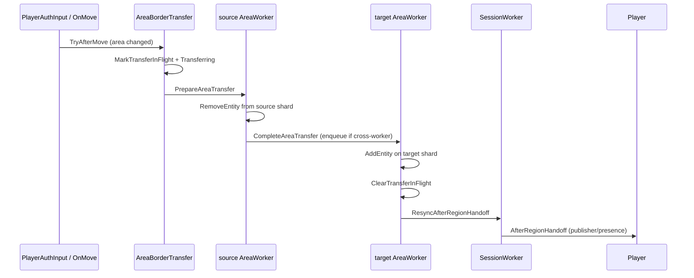

# Area threading (multithreaded simulation)

How Orion splits the world into **threading areas**, assigns each area to an **AreaWorker**, and moves entities (including players) across workers without resetting the client.

Related: [Teleport](teleport.md) · [Architecture philosophy](architecture-philosophy.md).

## Overview

With area threading enabled (`AreaThreadingEnabled` + active scheduler):

- The overworld (and configured dimensions) is partitioned into spatial **areas** (`AreaShard` / `AreaResolver`).
- Each attached area runs on a dedicated **AreaWorker** (thread `area-worker-N`).
- Entities (players and mobs) are **simulated** (`entity.Tick`) on the worker that owns the current area’s shard.
- Dirty chunks are **saved by the owning worker** (not on a global dimension tick), avoiding races on shared dictionaries.
- Player chunk streaming / session traits run on the **SessionWorker** (separate thread).

Crossing an area **does not** require a client teleport: only server ownership changes (+ `AfterRegionHandoff` for publisher/presence).

## Components

| Component | Role |
|-----------|------|
| `AreaShard` | Static shard: chunks + entities for one area. Synchronized access; prefer `SnapshotChunks` / `SnapshotEntities`. |
| `AreaShardManager` | Resolves area index and aggregates dimension shards. |
| `AreaWorker` / `AreaWorkerPool` | ~20 TPS loop: drain inbox → tick attached entities → periodic dirty save. |
| `AreaScheduler` | Attaches/detaches areas to workers, starts transfers, routes packets by area. |
| `AreaBorderTransfer` | Detects border crossing (`TryAfterMove` / `TryAfterTeleport`) and starts handoff. |
| `CrossAreaTransferHandler` | `prepare` on source worker (remove from shard) → `complete` on target (add + resync). |
| `SessionWorker` | Session ticks (chunks); pauses the mover while `TransferState.Transferring`. |
| `ThreadGuard` (DEBUG) | Asserts “this thread is the area’s worker”. |

## AreaWorker cycle

1. `DrainInbox` (attach/detach, area packets, prepare/complete transfer, jobs).
2. `TickAttachedEntities` — snapshot each attached shard’s entities and `entity.Tick`.
3. `SaveAttachedDirtyChunks` (~every 20 ticks) — only this worker’s shards.
4. Worker `0` may also advance the global world tick when applicable.

## Area handoff

- **Same-worker**: prepare and complete on the same thread (near-zero gap).
- **Cross-worker**: prepare and complete on different threads (distinct `managedTid`); that is real ownership.

### Peer contract

- Broadcast `MoveActorDelta` on the border step.
- RuntimeId is **in-flight** during prepare→complete: `UpdateVisibleEntities` does not send `RemoveActor`.
- Without that, spectators saw a remove→add flicker when the player crossed areas.

## What does NOT change on a thread switch

- Player position on the server (already updated by AuthInput / Teleport).
- Chunk columns already loaded on the client (no `ForceReloadViewDistance` just for a worker change).
- Client velocity (no `MovePlayer(Teleport)` on handoff).

Full chunk reload remains for: dimension change, or destination not yet rendered (`ForceFullChunkReload` / `OnTeleport`).

## Persistence and thread-safety

- `AreaShard` uses an internal lock; safe enumeration via snapshots.
- Global dirty save in `Dimension.Tick` was removed; each worker saves its shards.
- Entity/chunk mutations for an area should run on the attached worker (or via an inbox message).

## Config / debug

- `AreaThreadingEnabled`, area worker count (thread budget at boot).
- `AreaSchedulerDebug`: Debug logs for attach/transfer (off by default).
- Transfer failures: `[Area:Transfer] abort` + player disconnect.

## Main files

| File | Role |
|------|------|
| `World/Threading/AreaShard.cs` | Per-area data + sync. |
| `World/Threading/AreaShardManager.cs` | Index / AllChunks. |
| `Orion/Scheduling/AreaWorker.cs` | Simulation loop. |
| `Orion/Scheduling/AreaScheduler.cs` | Attach + begin transfer + routing. |
| `Orion/Scheduling/AreaBorderTransfer.cs` | Border detection. |
| `Orion/Scheduling/CrossAreaTransferHandler.cs` | Prepare/complete + in-flight. |
| `World/Dimension/Dimension.cs` | `SaveDirtyChunks(AreaShard)`. |

## Checklist when changing this system

1. Entity simulation for area X only on the worker attached to X.
2. Handoff: mark in-flight before remove; clear after add.
3. Do not force teleport/chunk reload solely because `crossWorker == true`.
4. Dirty save on the owning worker, not an unsynchronized global loop.
5. Peers: border delta + no despawn while in-flight.
