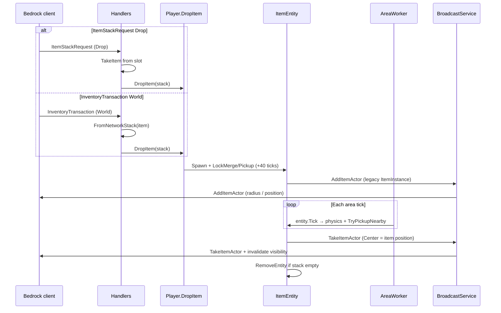

# Item drop (client ↔ server)

This document describes how Orion handles **dropping** items into the world (Q / drag out of inventory), `ItemEntity` spawn, physics ticks, and pickup — and why protocol encoding plus spatial broadcast matter.

Related: inventory via `ItemStackRequest` / `InventoryTransaction` (handlers under `src/Orion/Network/Handlers/`).

## Problem this flow solves

Three failures showed up together when drop “did nothing” or left a ghost item:

1. **Decode overflow** — the client sends `NetworkItemStackDescriptor` (Int16 network id) in `InventoryAction` / held item. Reading as legacy `ItemInstance` (ZigZag) misaligns the buffer and breaks the handler.
2. **Floating / no pickup** — area-attached entities were **not ticked**: only worker 0 called `world.Tick()`, with no `entity.Tick` on shards → no physics, merge, or pickup.
3. **Ghost after pickup** — `RemoveActor` / `TakeItemActor` used center `(0,0,0)` for spatial filtering; nearby clients never got the remove while visibility tracking still thought the actor existed.

## Two drop paths in the protocol

Modern Bedrock uses **two** channels; Orion handles both and ends in `Player.DropItem`.

| Path | Packet | When |
|------|--------|------|
| Stack request | `ItemStackRequest` → `Drop` action (sometimes inside `PlayerAuthInput`) | UI / creative / hotbar with stack IDs |
| Legacy transaction | `InventoryTransaction` → `Normal` + `SourceType = World` | Classic world-interaction drop |



### Server step-by-step

1. **Correct decode**
   - Inventory (`InventoryAction`, UseItem* held): `NetworkItemStackDescriptor`.
   - World (`AddItemActor`): legacy ZigZag `ItemInstance` — **not** the same wire format.

2. **`Player.DropItem`**
   - Position ≈ feet + 1.15 Y; velocity from yaw/pitch (Basalt-style).
   - `LockMergeUntil` / `LockPickupUntil` = current tick + **40**.
   - `Spawn` → broadcast `AddItemActor`.

3. **`AreaWorker.TickAttachedEntities`**
   - Every worker with attached areas ticks shard entities.
   - Flush `PendingDespawn` via `RemoveEntity`.

4. **Pickup (`ItemEntity.TryPickupNearby`)**
   - After lock, ~1.5 radius; `player.CollectItem`.
   - Broadcast `TakeItemActor` with `Center = Position`.
   - Empty stack: `Despawn` + immediate `RemoveEntity`.
   - `BroadcastService` invalidates visibility on `TakeItemActor` / `RemoveActor`.

5. **`GetPacketPosition`**
   - Returns `null` for packets without a useful position (`RemoveActor`, `TakeItemActor`, …) → fan-out to **all** players in the dimension (Basalt behaviour), instead of filtering around `(0,0,0)`.

## Encoding: inventory vs item actor

```
InventoryAction / InventorySlot / Content
  └── NetworkItemStackDescriptor  (Int16 network id, …)

AddItemActor
  └── ItemInstance                (ZigZag network id, …)
```

Server conversion: `ItemStack.FromNetworkStack(NetworkItemStackDescriptor)` (and the reverse via `ToNetworkStack` / `LegacyItem` on spawn).

## Key files

| Piece | Path |
|-------|------|
| Drop (ISR) | `src/Orion/Network/Handlers/ItemStackRequest.cs` (`HandleDrop`) |
| Drop (IT) | `src/Orion/Network/Handlers/InventoryTransaction.cs` (`SpawnWorldDrop`) |
| Spawn / locks | `src/Orion/Player/Player.cs` (`DropItem`) |
| Entity | `src/Orion/Entity/ItemEntity.cs` |
| Tick | `src/Orion/Scheduling/AreaWorker.cs` |
| Broadcast | `src/Orion/Network/BroadcastService.cs`, `DimensionGameplayExtensions.GetPacketPosition` |
| Visibility | `orion:player-chunk-rendering` (`IPlayerChunkView`) |

## Regression checklist

- [ ] Q on hotbar removes the item and spawns an actor near the player.
- [ ] After ~2 s the item can be collected; take animation plays and the entity disappears.
- [ ] A nearby second player sees spawn and removal (no ghost).
- [ ] Both UI drop and world-transaction drop work.
- [ ] No `OverflowException` when dropping / using items after login.
