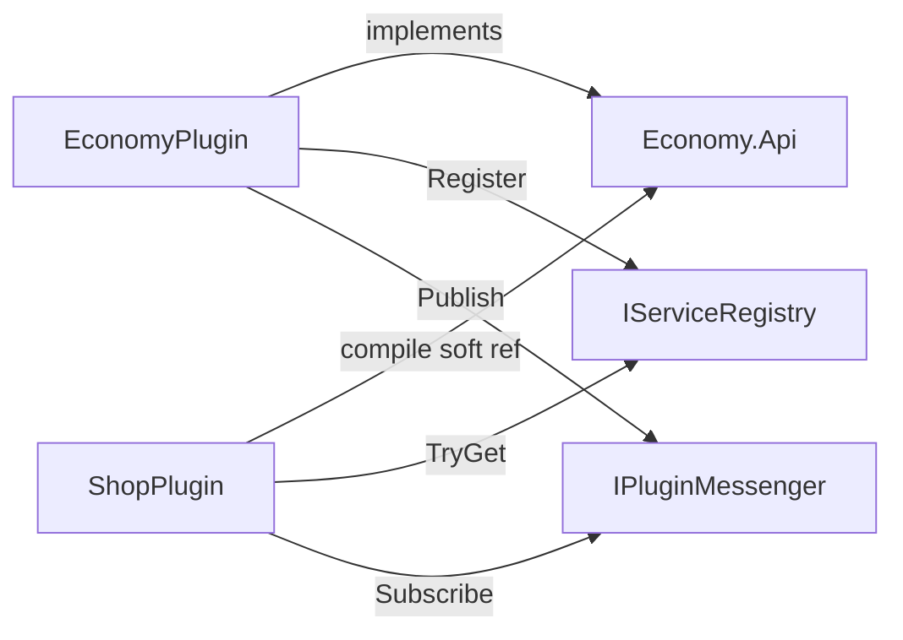

# Phase 7 — Conflicts & compatibility

**Status:** `implemented`  
**Language twin:** [`../../pt_br/plugins/07-conflicts-compatibility.md`](../../pt_br/plugins/07-conflicts-compatibility.md)

## 1. Goal

Document **inevitable conflicts** when two plugins touch the same resource, and ship **operator/developer tools** to detect, order, and contain them — without promising automatic semantic merges.

## 2. Non-goals

- Solving “two economies both register `IEconomy`” into one merged ledger.
- Binary rewriting / harmony-style patches between plugins.
- Guaranteeing compatibility across arbitrary third-party versions.

## 3. Public API sketch

### Conflict policy config

```json
"Plugins": {
  "Enabled": false,
  "Directory": "plugins",
  "ConflictMode": "warn"
}
```

`ConflictMode`: `warn` (default) | `fail` (boot or registration throws).

### Diagnostics

```csharp
public interface IPluginDiagnostics
{
    IReadOnlyList<PluginConflict> Conflicts { get; }
    IReadOnlyList<IPluginManifest> LoadedManifests { get; }
}

public sealed record PluginConflict(
    string Kind,           // "registry.item", "service", "packet.owner", "event"
    string Key,
    string WinnerPluginId,
    string LoserPluginId,
    string Message);
```

### `/plugins` command (extended)

```
Plugins (2)
  Economy 1.2.0 [provides: economy:api]
  Shop 1.0.0 (softdepend: Economy) [IEconomy: ok]
Conflicts (1)
  WARN registry.item minecraft:stick MinimalInventoryItems > OtherStickPlugin
```

## 4. Boot / runtime sequence

Conflict detection points:

1. Manifest duplicate ids / cycles — **always fail**.
2. Registry double-register — per `ConflictMode`.
3. Service double-register — allowed; **priority picks winner**; record diagnostic.
4. Packet `TryOwnHandler` — second fails; diagnostic.
5. Event cancel fights — not auto-detected; document priority discipline.

## 5. File touch list

| Path | Change |
|------|--------|
| [`PluginsConfig`](../../../src/Config/PluginsConfig.cs) | `ConflictMode` |
| PluginHost / registries / services / packet pipeline | Emit `PluginConflict` |
| [`PluginsCommand`](../../../src/Orion/Commands/List/Operator/Plugins.cs) | Rich listing |
| Logger | Structured warn lines with plugin ids |

## 6. Acceptance tests

- Two creative registrations for same identifier ⇒ warn or fail.
- Two `IEconomy` registrations ⇒ `TryGet` returns highest priority; `/plugins` shows both.
- Packet ownership conflict ⇒ second `TryOwnHandler` false + conflict entry.
- `ConflictMode: fail` aborts boot on registry clash during WorldInit.

## 7. Migration notes from current stub

No conflict tooling today; first registration silently wins in catalog pending entries. Phase 7 makes that explicit.

## 8. Status

`implemented`

## Tooling matrix (what we provide)

| Problem | Tool |
|---------|------|
| Optional integration | `softdepend` + Services `TryGet` + Messenger |
| Required integration | `depend` (fail if missing) |
| Capability discovery | `provides` + `/plugins` |
| Same event, different behavior | `EventPriority` + cancel checks |
| Same item/block id | Ownership + ConflictMode |
| Same packet handler | `TryOwnHandler` single owner |
| Same service interface | `ServicePriority` |
| Observe without interfering | `EventPriority.Monitor` |

## What remains inevitable

- Two plugins both cancelling/uncancelling chat for opposite reasons — last mutating priority wins; operators disable one.
- Two plugins simulating the same projectile stack — choose one owner via packet ownership or don’t install both.
- Version skew on `Foo.Api` — semver discipline on soft API packages; host cannot fix bad references.

## Compatibility without load coupling



Shop does **not** hard-reference Economy’s implementation assembly; load order uses softdepend only when both exist.
