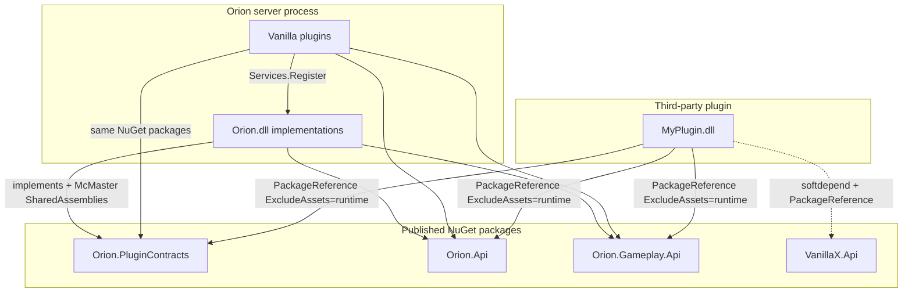

# Phase 9 — Orion Plugin SDK overview (final architecture)

**Status:** `spec`  
**Language twin:** [`../../pt_br/plugins/09-sdk-overview.md`](../../pt_br/plugins/09-sdk-overview.md)

## 1. Goal

Define the **final, maximal Orion Plugin SDK**: published NuGet packages that let third parties build **deep gameplay plugins** (blocks, items, inventory, world mutation, entities, containers) **without cloning the Orion monorepo**, while first-party Vanilla\* plugins compile against the **same** packages (dogfooding).

This document is the architecture anchor. Implementation order for AIs: [10](10-sdk-packages-versioning.md) → [11](11-sdk-orion-api-surface.md) → [12](12-sdk-registries-traits.md) → [13](13-sdk-events-signals.md) → [14](14-sdk-gameplay-services.md) → [15](15-sdk-protocol-escape.md) → [16](16-sdk-external-plugin-guide.md) → [17](17-sdk-vanilla-dogfood.md) → [18](18-sdk-ai-implementation-checklist.md).

Phases 1–7 ([loader](01-loader-contracts-mcmaster.md) through [conflicts](07-conflicts-compatibility.md)) remain the platform substrate. The SDK **extends** them; it does not replace McMaster, lifecycle, or the thin contracts shell.

## 2. Non-goals

- Sandboxing / untrusted-plugin security isolation.
- Native AOT host with dynamic plugins (incompatible with McMaster).
- Hot-reload / unload of plugins in the first SDK ship.
- Shipping a single monolithic `Orion.dll` NuGet as the public API.
- Temporary “DevKit HintPath to server Orion.dll” as a supported authoring path.
- Putting third-party service interfaces into `Orion.PluginContracts` or `Orion.Api` (those stay in `Foo.Api` packages — see [05](05-services-messaging.md)).

## 3. Final package graph



| Package | Role | McMaster shared |
|---------|------|-----------------|
| **Orion.PluginContracts** | Lifecycle, event bus shell, thin registry facades, services, messenger, packet pipeline | Yes |
| **Orion.Api** | Stable facades: server, world, dimension, player, entity, block, item, container; typed signals; rich registries | Yes |
| **Orion.Gameplay.Api** | Domain services: inventory, building, mining, attributes, item-use | Yes |
| **Vanilla\*.Api** | Optional first-party extras beyond Gameplay.Api (Foo.Api pattern) | Host allowlist when first-party |
| **Protocol** (optional) | Packet/NBT escape hatch only | Not shared by default |

## 4. Current state → final state

| Problem today | Final state |
|---------------|-------------|
| Vanilla\* `ProjectReference` `Orion.csproj` | Vanilla\* and third parties reference NuGets only |
| `InternalsVisibleTo` Vanilla\* | Removed for production plugins; tests only |
| `IOrionServer` / `IOrionWorld` empty stubs | Rich facades in `Orion.Api` |
| Gameplay interfaces live in `Orion.dll` | Moved to `Orion.Gameplay.Api` |
| Block/item registry = allowlist/hash only | Rich registrations + trait registries in `Orion.Api` |
| Deep plugins construct Protocol packets ad hoc | Prefer `Orion.Api` helpers; Protocol is documented escape hatch |
| `api` in `plugin.json` stored but not enforced | Boot validates against host SDK major.minor |
| Doc rule “don’t reference Orion” vs Vanilla reality | Aligned: nobody references the monolith at compile time |

## 5. Plugin neutrality (host)

The Orion **runtime does not hardcode** first-party plugin ids (`Vanilla*` or `orion:*`). Core resolves gameplay via `PluginHost.Services.TryGet<T>()` and cancellable signals. `provides` names a **capability**, not a plugin id — multiple plugins must not claim the same exclusive PacketId or registry key ([07](07-conflicts-compatibility.md)).

First-party plugins use the same manifest ids as third parties (`orion:inventory`, etc.) — see [17](17-sdk-vanilla-dogfood.md) and [21](21-plugin-repo-layout.md).

## 6. Hard rules (final)

1. **No monorepo clone required** to author plugins — NuGet restore is enough.
2. **No `ProjectReference` to `src/Orion/Orion.csproj`** from any plugin (first-party or third-party).
3. **No `InternalsVisibleTo` for plugin assemblies** (except `Orion.Game.Tests` and similar test projects).
4. **Shared types** across ALC are exactly the published SDK assemblies listed in [10](10-sdk-packages-versioning.md).
5. **`plugin.json` `api`** must satisfy host SDK version (see [10](10-sdk-packages-versioning.md)).
6. **Domain capabilities** are discovered via `provides` + `IServiceRegistry.TryGet` (soft) or `depend` (hard).
7. **Packet hooks** remain the escape hatch when no high-level API exists ([15](15-sdk-protocol-escape.md)).

## 7. Use-case → package matrix
|---|----------|:---:|:---:|:---:|:---:|:---:|
| 1 | Creative tab filler | required | — | — | — | — |
| 2 | Command + chat message | required | required | — | — | — |
| 3 | Soft Economy ↔ Shop | required | — | — | — | Economy.Api |
| 4 | Give / clear / open inventory | required | required | required | — | — |
| 5 | Cancel place/break; setblock | required | required | optional | — | — |
| 6 | Custom block + trait + UI | required | required | optional | escape | — |
| 7 | Custom item + trait | required | required | optional | — | — |
| 8 | Damage / hunger / heal | required | required | required | — | — |
| 9 | Custom container Show/Close | required | required | optional | escape | orion:containers |
| 10 | Packet escape hatch | required | — | — | optional | — |
| 11 | Custom generator | required | required | — | — | — |
| 12 | Vanilla\* dogfood | required | required | required | escape as today | as needed |

Full walkthroughs: [16](16-sdk-external-plugin-guide.md). Vanilla migration: [17](17-sdk-vanilla-dogfood.md).

## 7. Glossary (SDK)

| Term | Meaning |
|------|---------|
| **SDK** | Published NuGet set: PluginContracts + Orion.Api + Gameplay.Api (+ optional Foo.Api) |
| **Facade** | Interface in Orion.Api implemented by Orion.dll wrappers around concrete types |
| **Deep plugin** | Plugin that mutates world/inventory/entities via Orion.Api / Gameplay.Api |
| **Integration plugin** | Plugin that only uses events, services, messenger, registries (contracts) |
| **Dogfooding** | First-party Vanilla\* plugins compile against the same NuGets as third parties |
| **Escape hatch** | `IPacketPipeline` and/or direct Protocol package for features without a facade yet |

## 8. Public API sketch (orientation only)

Stable entry points after SDK lands:

```csharp
// Load / Enable — PluginContracts (unchanged shape)
void Load(IPluginLoadContext context);
void OnEnable(IPluginContext context);

// Deep gameplay — Orion.Api
IPlayer player = /* from signal */;
IDimension dim = player.Dimension;
dim.SetBlock(x, y, z, block);
player.SendMessage("Hello");

// Domain — Gameplay.Api
if (context.Services.TryGet(out IPlayerInventoryService? inv) && inv is not null)
    inv.TryGive(player, stack, out _);
```

Full surface: [11](11-sdk-orion-api-surface.md), [14](14-sdk-gameplay-services.md).

## 9. File touch list (implementation later)

| Path | Role |
|------|------|
| New `src/Orion.Api/Orion.Api.csproj` | Facades, signals, rich registry DTOs |
| New `src/Orion.Gameplay.Api/Orion.Gameplay.Api.csproj` | Move from `src/Orion/Gameplay/` |
| `src/PluginContracts/` | Keep lifecycle; thin registries evolve per [12](12-sdk-registries-traits.md) |
| `src/Orion/Plugins/PluginHost.cs` | Expand SharedAssemblies; validate `api` |
| `plugins/Vanilla*/` | PackageReference NuGets; drop Orion ProjectReference |
| `templates/OrionPlugin/` | `dotnet new` template (optional ship with SDK) |
| CI | Pack + publish NuGet (GitHub Packages or nuget.org) |

## 10. Acceptance tests (architecture)

- A third-party plugin project restores NuGets only (no git submodule of Orion) and builds.
- That plugin loads under McMaster with `typeof(IPlayer).Assembly` shared with the host.
- VanillaInventory builds without `ProjectReference` to Orion and still registers `IPlayerInventoryService`.
- Boot rejects plugins whose `api` major.minor is newer than the host SDK.
- Docs 09–18 status flip to `implemented` only when [18](18-sdk-ai-implementation-checklist.md) DoD is met.

## 11. Migration notes

- Do not publish a “compile against Orion.dll” path.
- Do not leave stubs: `IOrionServer` / `IOrionWorld` are replaced/superseded by `Orion.Api` facades in the final ship.
- Phases 01–07 docs stay valid; update “plugins must not reference Orion” to “plugins must not reference the Orion **implementation** assembly — use NuGet SDK”.

## 12. Status

`spec`

## Reading order for implementers

1. This overview  
2. [10 — Packages & versioning](10-sdk-packages-versioning.md)  
3. [11 — Orion.Api surface](11-sdk-orion-api-surface.md)  
4. [12 — Registries & traits](12-sdk-registries-traits.md)  
5. [13 — Events & signals](13-sdk-events-signals.md)  
6. [14 — Gameplay services](14-sdk-gameplay-services.md)  
7. [15 — Protocol escape](15-sdk-protocol-escape.md)  
8. [16 — External plugin guide](16-sdk-external-plugin-guide.md)  
9. [17 — Vanilla dogfood](17-sdk-vanilla-dogfood.md)  
10. [18 — AI implementation checklist](18-sdk-ai-implementation-checklist.md)  
