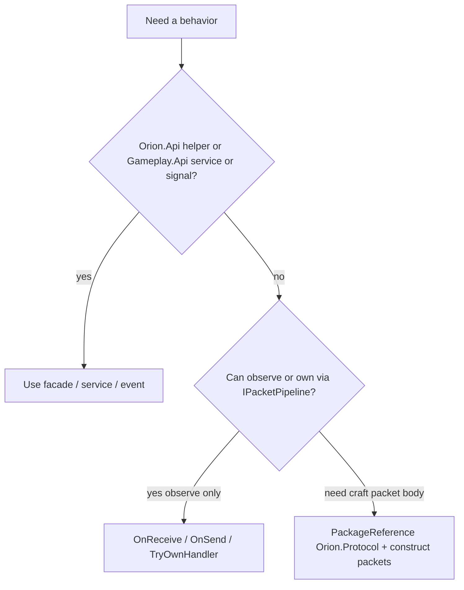

# Phase 15 — Protocol escape hatch (final)

**Status:** `spec`  
**Language twin:** [`../../pt_br/plugins/15-sdk-protocol-escape.md`](../../pt_br/plugins/15-sdk-protocol-escape.md)  
**Depends on:** [11 — Orion.Api](11-sdk-orion-api-surface.md), [06 — Packet hooks](06-packet-hooks.md)

## 1. Goal

Document the **final** policy for when plugins may depend on the Protocol package and use `IPacketPipeline`, versus when they must use Orion.Api helpers / Gameplay.Api services — without making Protocol a shared McMaster assembly or a required SDK dependency.

## 2. Non-goals

- Sharing Protocol across ALC by default.
- Re-implementing the entire Bedrock packet surface as Orion.Api methods in the first SDK train.
- Allowing plugins to replace core codecs.

## 3. Decision tree (final)



| Prefer | Examples |
|--------|----------|
| Orion.Api | `IDimension.SetBlock`, `BlockNetwork.CreateUpdateBlock`, `IPlayer.SendMessage`, `IPlayer.Teleport` |
| Gameplay.Api | `IPlayerInventoryService.TryGive`, mining/building handlers |
| Signals | Cancel place/break/eat ([13](13-sdk-events-signals.md)) |
| `IPacketPipeline` | Metrics, anti-cheat observe, temporary feature before facade exists |
| Protocol package | Custom `BlockActorData` NBT, niche packets with no helper yet |

## 4. Public API sketch

### Pipeline (already in PluginContracts)

```csharp
context.Packets.OnReceive(PacketId.SomeId, (ctx) => { /* inspect / cancel */ }, EventPriority.Normal);
context.Packets.TryOwnHandler((int)PacketId.ItemStackRequest, this, handler);
```

### Helpers (Orion.Api — preferred send path)

```csharp
player.Send(BlockNetwork.CreateUpdateBlock(pos, permutation));
dimension.Broadcast(BlockNetwork.CreateUpdateBlock(pos, permutation));
```

### Protocol escape (plugin csproj)

```xml
<PackageReference Include="Orion.Protocol" Version="0.1.0" />
```

```csharp
using Orion.Protocol.Packets;

player.Send(new UpdateBlockPacket { /* … */ }); // IPlayer.Send accepts IOutboundPacket; host adapter wraps DataPacket
```

**Final rule:** `IPlayer.Send` / `IDimension.Broadcast` accept `IOutboundPacket`. Host provides implicit conversion/adapter from Protocol `DataPacket` when Protocol is referenced. Plugins without Protocol never see `DataPacket`.

### SharedAssemblies

Protocol is **not** in the default shared list ([10](10-sdk-packages-versioning.md)). Each plugin may load its own Protocol copy for type construction; crossing ALC with Protocol types in public service interfaces is **forbidden**. Public APIs use Orion.Api types only.

## 5. Ownership vs hooks

| Mechanism | Semantics |
|-----------|-----------|
| `TryOwnHandler` | Exclusive decode/handle for that PacketId; failure if already owned |
| `OnReceive` / `OnSend` | Non-exclusive observe/cancel/replace payload per [06](06-packet-hooks.md) |

VanillaInventory owns ISR / ContainerClose / MobEquipment ([14](14-sdk-gameplay-services.md)). Third parties extend inventory via services/events, not by stealing those PacketIds.

## 6. File touch list

| Path | Change |
|------|--------|
| `Orion.Api.Network` helpers | Expand as Vanilla use-cases demand (`UpdateBlock`, common actor packets) |
| Protocol csproj | Packable as `Orion.Protocol` |
| `IPlayer.Send` | `IOutboundPacket` + adapter |
| Docs / analyzer (optional) | Warn on Protocol reference when helper exists |

## 7. Acceptance tests

- Plugin without Protocol PackageReference can place blocks via `IDimension.SetBlock` and update clients via helpers.
- Plugin with Protocol can send `UpdateBlockPacket` through adapter.
- Service interface cannot expose `DataPacket` in public Gameplay.Api signatures.
- Second `TryOwnHandler` for `ItemStackRequest` fails when VanillaInventory loaded.

## 8. Migration notes

- Vanilla\* may keep Protocol references for implementation details; public registration surface stays Gameplay.Api / Orion.Api.
- New high-level helpers are added to Orion.Api when the same Protocol pattern repeats across ≥2 plugins.

## 9. Status

`spec`
