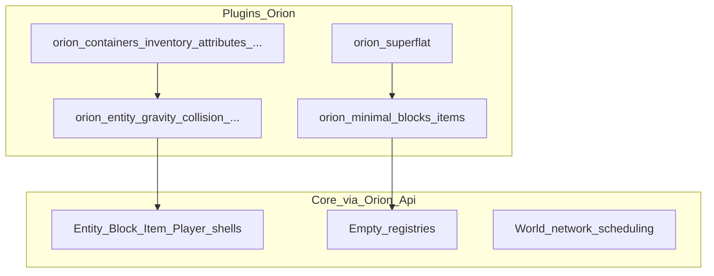
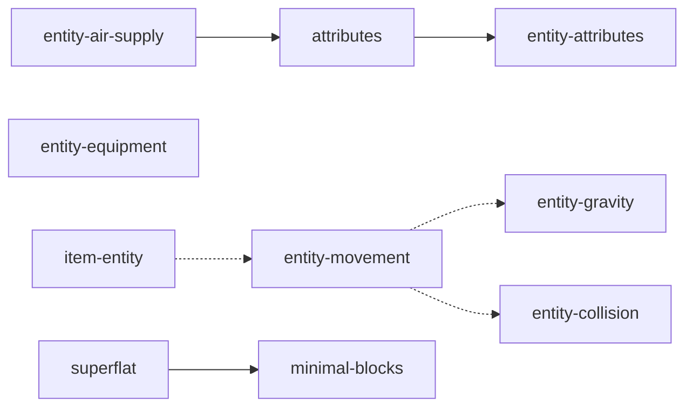

# Phase 22 — Vision: Vanilla extraction → plugins

**Status:** `spec`  
**Language twin:** [`../../pt_br/plugins/22-vanilla-extraction-overview.md`](../../pt_br/plugins/22-vanilla-extraction-overview.md)  
**Depends on:** [09](09-sdk-overview.md)–[18](18-sdk-ai-implementation-checklist.md) (SDK), [17](17-sdk-vanilla-dogfood.md), [19](19-manifest-v2.md)–[21](21-plugin-repo-layout.md)  
**AI order:** [31 — Checklist](31-extraction-ai-checklist.md)

## 1. Goal

Document and sequence the migration of gameplay still embedded in `src/Orion/` (**Block**, **Entity**, **Item**, **Player**, **Traits**) plus native **content/worldgen** into **first-party plugins** under `Plugins-Orion/`, so that:

1. The core is a **minimal engine** (network, world, sessions, scheduling, type shells).
2. Plugin authors do not need the monorepo — NuGet only (`PluginContracts` + `Orion.Api` + `Orion.Gameplay.Api`).
3. Each generic mechanic (gravity, collision, block orientation, …) is a **dedicated plugin** with correct deps.
4. Minimal content (current 6 blocks) and **superflat** leave the core; first-run uses generator **`void`**.

This phase is the conceptual anchor. Implementation: phases [23](23-extraction-sdk-prerequisites.md)–[30](30-first-run-and-boot-order.md).

## 2. Non-goals

- Rewriting full vanilla survival in this series.
- Publishing `Orion.dll` to NuGet.
- Turning `Entity.cs` / `Block.cs` / registries into “plugins” — they are **shells** behind `Orion.Api`.
- Requiring an async worldgen API (`Generate` is synchronous today).
- Duplicating the damage pipeline outside `orion:attributes`.

## 3. Hybrid model (locked)

| Stays in core / Orion.Api | Becomes a plugin |
|---------------------------|------------------|
| `Entity`, `Block`, `Item`, `Player` shells | Mechanic traits (gravity, collision, …) |
| Base `Trait` + tick details | Specific block/item/player traits |
| **Empty** registries + registration facades | Content (6 blocks + minimal items) |
| World, network, AreaShards, Protocol | `orion:superflat` |
| Builtin `void` generator | Typed signals → `Orion.Api.Events` catalog |

## 4. Current state (Jul 2026)

| Fact | Implication |
|------|-------------|
| 6 blocks in `BlockRegistry.RegisterFromBedrockStates` | Move all to `orion:minimal-blocks` |
| Entity/Block/Item/Player traits in Orion assembly | Extract to plugins 24–27 |
| `orion:attributes` already owns health/hunger + `EntityHurtSignal` | Do not create a parallel `orion:entity-damage` |
| First-party plugins still `ProjectReference` `Orion.csproj` | Blocked until SDK 11–12 + dogfood 17 |
| First-run default `generator: superflat` | Phase 30 → `void` |
| `IGeneratorRegistry` + `GeneratorFactory.Register` already exist | Superflat plugs in without a new loader |
| `Generate` / bootstrap pregen are synchronous | Phase 23 does not require async |

## 5. Phase → work map

| Phase | Focus |
|-------|-------|
| [23](23-extraction-sdk-prerequisites.md) | `Orion.Api` / `Gameplay.Api` gaps before moving code |
| [24](24-entity-mechanics-plugins.md) | Entity trait plugins + item-entity |
| [25](25-block-mechanics-plugins.md) | Orientation / BlockTrait plugins |
| [26](26-item-mechanics-plugins.md) | Durability / debug / components |
| [27](27-player-mechanics-plugins.md) | Chunk rendering / debug |
| [28](28-minimal-content-and-empty-core.md) | Minimal content; core without native registers |
| [29](29-worldgen-superflat-plugin.md) | Superflat plugin; void in core |
| [30](30-first-run-and-boot-order.md) | First-run, load order, minimal survival set |
| [31](31-extraction-ai-checklist.md) | Executable AI checklist |

## 6. Inventory → plugin ids (target)

| Area | Destination |
|------|-------------|
| `EntityGravityTrait` | `orion:entity-gravity` |
| `EntityCollisionTrait` | `orion:entity-collision` |
| `EntityMovementTrait` | `orion:entity-movement` (`softdepend` gravity + collision) |
| `EntityAttributeTrait` (base runtime) | `orion:entity-attributes` — **base**; `orion:attributes` `depend`s it |
| `EntityAirSupplyTrait` | `orion:entity-air-supply` (`depend` `orion:attributes`) |
| `EntityEquipmentTrait` | `orion:entity-equipment` |
| `ItemEntity` | `orion:item-entity` |
| Direction / Facing / Cardinal | `orion:block-direction`, `orion:block-facing`, `orion:block-cardinal` |
| Item durability / debug | `orion:item-durability`, `orion:item-debug` |
| Player chunk / debug | `orion:player-chunk-rendering`, `orion:player-debug` |
| 6 blocks + items | `orion:minimal-blocks` (+ `orion:minimal-items` or creative-fillers extension) |
| SuperFlat | `orion:superflat` (`depend` minimal-blocks) |
| Already shipped | containers, inventory, block_containers, attributes, building, mining, creative-fillers |

### Dependency graph (summary)

## 7. Hard rules (extraction)

1. **End state:** zero `ProjectReference` to `Orion.csproj` in any plugin.
2. **Compile** only against NuGet/SDK: `Orion.PluginContracts`, `Orion.Api`, `Orion.Gameplay.Api` (+ `Foo.Api` if any).
3. **Repo template** matches current plugins: `Plugins-Orion/orion:<id>/`, plugin.json v2, `Directory.Build.props`, `PackageId` `Orion.Plugins.*`, CI/publish workflows (paths + auto-bump), Trusted Publishing only on `OrionBedrock`.
4. **Commits:** Conventional Commits, granular, **no** `Co-authored-by`; prefer separate PRs `feat(plugins): …` vs `refactor(orion): remove … from core`.
5. **`air`:** registered by `orion:minimal-blocks` **before** world init (load priority + generators `depend` minimal-blocks). No permanent content stub in core.
6. **Damage:** ownership stays on `orion:attributes` (`IEntityHealthService`, hurt/die signals).

## 8. Mandatory template per new plugin

Repeat in each phase 24–29:

| Field | Value |
|-------|--------|
| Local folder | `Plugins-Orion/orion:<product>/` |
| GitHub repo | `OrionBedrock/orion-<product-with-hyphens>` |
| `PackageId` | `Orion.Plugins.<PascalName>` |
| Manifest | v2: `id`, `depend` / `softdepend` / `provides`, `main` |
| MSBuild | `OrionServerBERoot`, `PrivateAssets=all` on build refs |
| CI | `ci.yml` on `development`; `publish.yml` on `main` with paths + patch bump |
| Branches | Work on `development`; publish on merge to `main` |

## 9. Relation to phases 00–21

- [00](00-vision-minimal-engine.md) — this series **concretizes** the minimal-engine vision.
- [09](09-sdk-overview.md)–[18](18-sdk-ai-implementation-checklist.md) — contract **prerequisite**; extraction does not replace the SDK.
- [17](17-sdk-vanilla-dogfood.md) — after 24–29, dogfood includes the **new** trait/content plugins.
- [19](19-manifest-v2.md)–[21](21-plugin-repo-layout.md) — layout/manifest already `implemented`; new plugins must comply (folder id `orion:block_containers` with underscore).

## 10. Acceptance (this doc phase)

- [ ] Docs 22–31 exist in pt_br + en_us.
- [ ] Hub README lists the Vanilla Extraction section.
- [ ] Plugin id/dep graph is consistent across 22 and 24–29.
- [ ] No phase treats async generator API as a hard blocker.

## 11. Status

`spec` — anchor documentation; no code change from this phase alone.
