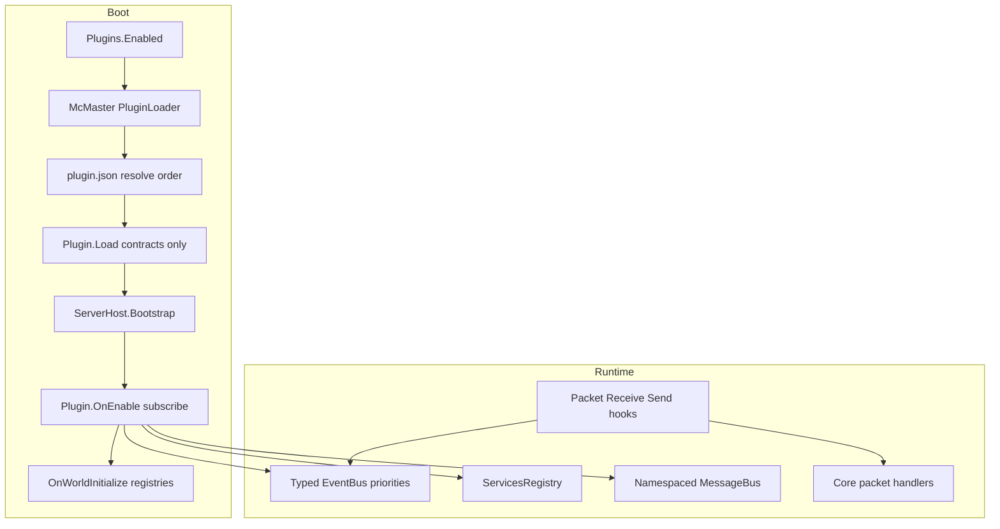

# Orion plugin architecture

**Status:** Phases 1–7 `implemented` (McMaster + events + registries + services + packet hooks + conflicts). SDK train (09–18) remains `spec`. Vanilla extraction (22–31) remains `spec`.

This hub describes how Orion becomes a **minimal Bedrock engine** whose gameplay surface grows through **third-party C# plugins**, loaded **exclusively** with **McMaster.NETCore.Plugins**, isolated by assembly load context, and coordinated through contracts, events, registries, services, messaging, and packet hooks. Deep gameplay without cloning the monorepo is specified in the **SDK series** ([09](09-sdk-overview.md)–[18](18-sdk-ai-implementation-checklist.md)). Migrating traits/content/worldgen still in core into first-party plugins is the **Vanilla extraction series** ([22](22-vanilla-extraction-overview.md)–[31](31-extraction-ai-checklist.md)).

Portuguese: [`../../pt_br/plugins/README.md`](../../pt_br/plugins/README.md)

## Locked decisions

| Topic | Decision |
|-------|----------|
| Loader | **Exclusive** [McMaster.NETCore.Plugins](https://github.com/natemcmaster/DotNetCorePlugins) 2.x — no `Assembly.LoadFrom`, custom ALC, or DLL scan without McMaster |
| Contracts | `Orion.PluginContracts` + published **`Orion.Api` / `Orion.Gameplay.Api`** (SDK) — plugins do **not** reference the Orion implementation assembly |
| Inter-plugin | Services registry (Bukkit-style) + namespaced message bus (`plugin:channel`) + optional `Foo.Api` packages |
| Conflicts | Priorities, cancel/replace, registry ownership, `provides` / `softdepend` — no magical merge |
| Packet hooks | Yes — dedicated phase (Endstone / PocketMine style escape hatch) |
| Runtime | **Managed** host when plugins are enabled (not Native AOT) |

## Boot pipeline (target)

## Phase map

| Phase | Doc | Goal | Spec status |
|-------|-----|------|-------------|
| 0 | [00 — Vision / minimal engine](00-vision-minimal-engine.md) | What stays in core vs plugins | `spec` |
| 1 | [01 — Loader & contracts (McMaster)](01-loader-contracts-mcmaster.md) | Isolation, shared types, layout | `implemented` |
| 2 | [02 — Lifecycle & manifest](02-lifecycle-manifest.md) | Load / Enable / WorldInitialize; `plugin.json` lifecycle | `implemented` (deps → [19](19-manifest-v2.md)) |
| 3 | [03 — Events & priorities](03-events-priorities.md) | Expose typed bus to plugins | `implemented` |
| 4 | [04 — Registries & content](04-registries-content.md) | Items, blocks, commands, creative tabs | `implemented` |
| 5 | [05 — Services & messaging](05-services-messaging.md) | Soft integration without hard load deps | `implemented` |
| 6 | [06 — Packet hooks](06-packet-hooks.md) | Low-level receive/send interception | `implemented` |
| 7 | [07 — Conflicts & compatibility](07-conflicts-compatibility.md) | Tooling when plugins collide | `implemented` |
| — | [08 — AI implementation checklist](08-ai-implementation-checklist.md) | Platform PR order (phases 1–7) | `spec` |
| 9 | [09 — SDK overview](09-sdk-overview.md) | Final NuGet SDK architecture for deep plugins | `spec` |
| 10 | [10 — Packages & versioning](10-sdk-packages-versioning.md) | NuGet layout, semver, SharedAssemblies | `spec` |
| 11 | [11 — Orion.Api surface](11-sdk-orion-api-surface.md) | IServer / IWorld / IDimension / IPlayer / block / item / container | `spec` |
| 12 | [12 — Registries & traits](12-sdk-registries-traits.md) | Rich registrations + trait registries | `spec` |
| 13 | [13 — Events & signals](13-sdk-events-signals.md) | Final signal catalog in Orion.Api.Events | `spec` |
| 14 | [14 — Gameplay services](14-sdk-gameplay-services.md) | Orion.Gameplay.Api + provides + packet ownership | `spec` |
| 15 | [15 — Protocol escape](15-sdk-protocol-escape.md) | Helpers vs Protocol PackageReference | `spec` |
| 16 | [16 — External plugin guide](16-sdk-external-plugin-guide.md) | Template + walkthroughs | `spec` |
| 17 | [17 — Vanilla dogfood](17-sdk-vanilla-dogfood.md) | First-party plugins on same SDK | `spec` |
| 18 | [18 — AI SDK checklist](18-sdk-ai-implementation-checklist.md) | Implementation order for SDK train | `spec` |
| 19 | [19 — Manifest v2](19-manifest-v2.md) | Object deps, SemVer ranges, fatal validation | `implemented` |
| 20 | [20 — Plugin developer guide](20-plugin-developer-guide.md) | Authoring, troubleshooting, best practices | `implemented` |
| 21 | [21 — Plugin repo layout](21-plugin-repo-layout.md) | `orion:*` folders, NuGet/CI | `implemented` |
| 22 | [22 — Vanilla extraction overview](22-vanilla-extraction-overview.md) | Traits/content/worldgen → plugins | `spec` |
| 23 | [23 — Extraction SDK prerequisites](23-extraction-sdk-prerequisites.md) | Orion.Api / Gameplay.Api gaps | `spec` |
| 24 | [24 — Entity mechanics](24-entity-mechanics-plugins.md) | Gravity, collision, movement, … | `implemented` |
| 25 | [25 — Block mechanics](25-block-mechanics-plugins.md) | Direction / facing / cardinal | `implemented` |
| 26 | [26 — Item mechanics](26-item-mechanics-plugins.md) | Durability / debug | `implemented` |
| 27 | [27 — Player mechanics](27-player-mechanics-plugins.md) | Chunk rendering / debug | `spec` |
| 28 | [28 — Minimal content](28-minimal-content-and-empty-core.md) | 6 blocks → plugin; empty core | `implemented` |
| 29 | [29 — Superflat plugin](29-worldgen-superflat-plugin.md) | Superflat out of core; void builtin | `implemented` |
| 30 | [30 — First-run void](30-first-run-and-boot-order.md) | Default void + minimum set | `implemented` |
| 31 | [31 — Extraction AI checklist](31-extraction-ai-checklist.md) | Runbook for implementing 22–30 | `spec` |

**Implemented (1–7, 19–21):** McMaster, lifecycle, registries, events, services/messenger, `IPacketPipeline`, conflict diagnostics, manifest v2, layout. See [first-run](../first-run.md).

**Next (SDK):** start at [09 — SDK overview](09-sdk-overview.md); implement via [18](18-sdk-ai-implementation-checklist.md).

**Then (Extraction):** [22](22-vanilla-extraction-overview.md) + runbook [31](31-extraction-ai-checklist.md) (requires SDK).

## Glossary

| Term | Meaning |
|------|---------|
| **Core / engine** | Networking, world/chunk persistence, sessions, scheduling, protocol codecs, minimal curated content |
| **Plugin** | Published C# assembly under `plugins/<Id>/` implementing `IOrionPlugin` |
| **Contracts / SDK** | `Orion.PluginContracts` + `Orion.Api` + `Orion.Gameplay.Api` — stable types shared across ALC boundaries |
| **Hard depend** | Manifest `depend` object — boot fails if missing or version out of range ([19](19-manifest-v2.md)) |
| **Soft depend** | Manifest `softdepend` object — reorder only when target exists |
| **Provides** | Manifest claim that this plugin supplies a named capability API |
| **Registry ownership** | At most one plugin “owns” a given registry key (e.g. identifier or PacketId) |
| **Escape hatch** | Packet hooks when no high-level event/API exists yet |

## Related docs

- [First run](../first-run.md)
- [Creative inventory](../creative-inventory.md)
- [Architecture philosophy](../architecture-philosophy.md)
- [Project status](../project-status.md)

## External inspiration (cited in phase docs)

- Paper / Bukkit — events, ServicesManager, softdepend
- PocketMine-MP — `DataPacketReceiveEvent`, plugin.yml deps
- Endstone — Bedrock `PacketReceiveEvent` / `PacketSendEvent`
- SerenityJS / the-aether — `onInitialize` / `onWorldInitialize` + palettes
- McMaster DotNetCorePlugins — ALC isolation and `sharedTypes`
