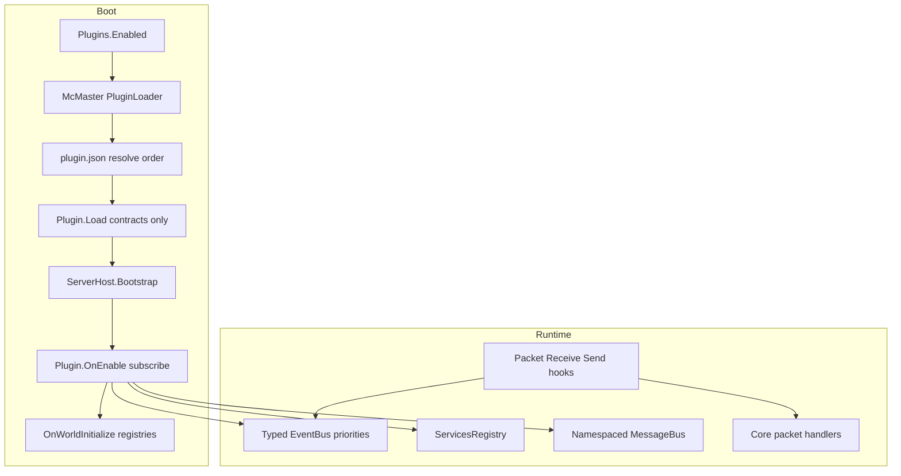

# Orion plugin architecture

**Status:** Phases 1–6 `implemented` (McMaster + events + registries + services + packet hooks). Later phases remain `spec`.

This hub describes how Orion becomes a **minimal Bedrock engine** whose gameplay surface grows through **third-party C# plugins**, loaded **exclusively** with **McMaster.NETCore.Plugins**, isolated by assembly load context, and coordinated through contracts, events, registries, services, messaging, and (later) packet hooks.

Portuguese: [`../../pt_br/plugins/README.md`](../../pt_br/plugins/README.md)

## Locked decisions

| Topic | Decision |
|-------|----------|
| Loader | **Exclusive** [McMaster.NETCore.Plugins](https://github.com/natemcmaster/DotNetCorePlugins) 2.x — no `Assembly.LoadFrom`, custom ALC, or DLL scan without McMaster |
| Contracts | Thin `Orion.PluginContracts` assembly — plugins do **not** reference the Orion monolith |
| Inter-plugin | Services registry (Bukkit-style) + namespaced message bus (`plugin:channel`) |
| Conflicts | Priorities, cancel/replace, registry ownership, `provides` / `softdepend` — no magical merge |
| Packet hooks | Yes — dedicated phase (Endstone / PocketMine style escape hatch) |
| Runtime | **Managed** host when plugins are enabled (not Native AOT) |

## Boot pipeline (target)

## Phase map

| Phase | Doc | Goal | Spec status |
|-------|-----|------|-------------|
| 0 | [00 — Vision / minimal engine](00-vision-minimal-engine.md) | What stays in core vs plugins | `spec` |
| 1 | [01 — Loader & contracts (McMaster)](01-loader-contracts-mcmaster.md) | Isolation, shared types, layout | `implemented` |
| 2 | [02 — Lifecycle & manifest](02-lifecycle-manifest.md) | Load / Enable / WorldInitialize; `plugin.json` | `implemented` |
| 3 | [03 — Events & priorities](03-events-priorities.md) | Expose typed bus to plugins | `implemented` |
| 4 | [04 — Registries & content](04-registries-content.md) | Items, blocks, commands, creative tabs | `implemented` |
| 5 | [05 — Services & messaging](05-services-messaging.md) | Soft integration without hard load deps | `implemented` |
| 6 | [06 — Packet hooks](06-packet-hooks.md) | Low-level receive/send interception | `implemented` |
| 7 | [07 — Conflicts & compatibility](07-conflicts-compatibility.md) | Tooling when plugins collide | `implemented` |
| — | [08 — AI implementation checklist](08-ai-implementation-checklist.md) | PR order, APIs, acceptance tests | `spec` |

**Implemented (PR 1–7):** McMaster, lifecycle, registries, events, services/messenger, `IPacketPipeline`, conflict diagnostics (`ConflictMode` / `/plugins`). See [first-run](../first-run.md).

## Glossary

| Term | Meaning |
|------|---------|
| **Core / engine** | Networking, world/chunk persistence, sessions, scheduling, protocol codecs, minimal curated content |
| **Plugin** | Published C# assembly under `plugins/<Id>/` implementing `IOrionPlugin` |
| **Contracts** | `Orion.PluginContracts` — stable types shared across ALC boundaries |
| **Hard depend** | Manifest `depend` — boot fails if missing |
| **Soft depend** | Manifest `softdepend` — reorder only; discover at runtime via Services / Messenger |
| **Provides** | Manifest claim that this plugin supplies a named capability API |
| **Registry ownership** | At most one plugin “owns” a given registry key (e.g. identifier or PacketId) |
| **Escape hatch** | Packet hooks when no high-level event/API exists yet |

## Related docs

- [First run](../first-run.md)
- [Creative inventory](../creative-inventory.md)
- [Architecture philosophy](../architecture-philosophy.md)
- [Project status](../project-status.md)

## External inspiration (cited in phase docs)

- Paper / Bukkit — events, ServicesManager, softdepend
- PocketMine-MP — `DataPacketReceiveEvent`, plugin.yml deps
- Endstone — Bedrock `PacketReceiveEvent` / `PacketSendEvent`
- SerenityJS / the-aether — `onInitialize` / `onWorldInitialize` + palettes
- McMaster DotNetCorePlugins — ALC isolation and `sharedTypes`
