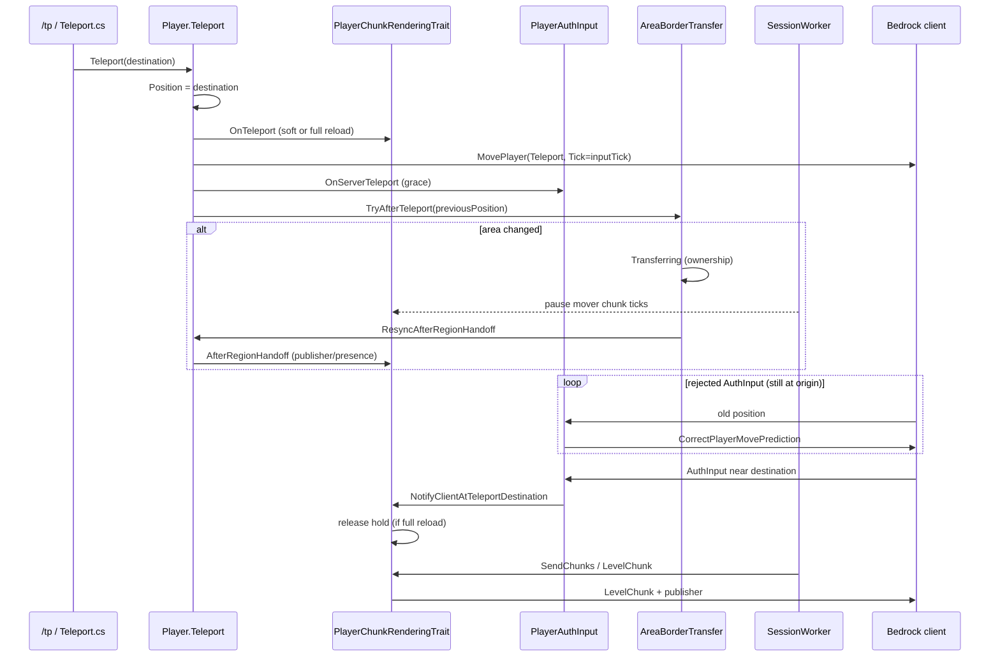

# Teleport (client ↔ server)

Current Orion teleport flow (e.g. `/tp`), Bedrock server-authoritative movement, chunk streaming, and area-threading interaction.

Related: [Chunk streaming](chunk-streaming.md) · [Area threading](area-threading.md).

## Problem this flow solves

A long `/tp` (e.g. `0,0` → `1000,1000`) crosses **areas** and moves the chunk view center. Historical failures this flow avoids:

1. Area transfer without `Player.Teleport()` (no client `MovePlayer` / chunks).
2. `MovePlayer.Tick` set to the world tick instead of **PlayerInputTick** (client ignores the teleport).
3. Destination `LevelChunk` before the client applies `MovePlayer` (chunks discarded; server marked `loaded` and never resent).

## Sequence (same dimension)

### Server step-by-step

1. **`Player.Teleport`**
   - Updates `Position` **before** any area transfer.
   - Fires `OnTeleport` on traits.
   - Sends `MovePlayer` with `Tick = GetLastInputTick()` (not world tick).
   - On dimension-type change (or force): also `ChangeDimension`.
   - Opens grace (`OnServerTeleport`) then `AreaBorderTransfer.TryAfterTeleport(previousPosition)`.

2. **`PlayerChunkRenderingTrait.OnTeleport`**
   - **Full reload** if `ForceFullChunkReload` (dimension change) **or** destination chunk is not in `_loadedChunks`: client unload, clear loaded/requests, new publisher, hold until client syncs.
   - **Soft** if destination is already rendered (e.g. Y-only `/tp`, or new area still in view): keep columns; retarget streaming / presence only.

3. **Area transfer** (`TryAfterTeleport` / `TryAfterMove`)
   - Compares previous-position area vs current.
   - If different: `BeginTransfer` → session `Transferring` → `CrossAreaTransferHandler` (prepare on source worker, complete on target) → `ResyncAfterRegionHandoff` on the session thread.

4. **While `Transferring`**
   - `SessionWorker` skips session-tick traits **for the transferring player** (chunks) so streaming does not run mid-handoff.

5. **`ResyncAfterRegionHandoff`**
   - Always soft: `AfterRegionHandoff()` only (publisher + presence + visible entities).
   - Worker/thread switch is **server ownership only** — no second `MovePlayer` and no `ForceReloadViewDistance`.

6. **Hold release** (full reload)
   - Preferred: first accepted `PlayerAuthInput` near destination → `NotifyClientAtTeleportDestination`.
   - Fallback: hold timeout.
   - Only then does the scan send destination `LevelChunk`s.

## Peer visibility (border)

On the border-crossing step:

- The mover’s `MoveActorDelta` is **still broadcast** to peers (before the transfer early-return).
- During prepare→complete the runtimeId is **in-flight**; peers **do not** `RemoveActor` merely because the entity briefly left `GetEntities()`.
- Spectators therefore do not see a remove→add flicker when crossing threading areas.

## Client contract (movement)

| Packet / field | Role |
|----------------|------|
| `MovePlayer` `Mode=Teleport` (or `Reset` on dim change) | Absolute authoritative position. |
| `MovePlayer.Tick` | Last `PlayerAuthInput` tick, not world tick. |
| `StartGame.PlayerMovementSettings.RewindHistorySize` | > 0 (Orion uses `100`) so corrections / teleports with rewind are accepted. |
| `CorrectPlayerMovePrediction` | When AuthInput is too far from server (common right after `/tp`). |
| Grace (`OnServerTeleport`) | A few ticks waiting for the client to apply MovePlayer. |

## Client contract (chunks)

See [chunk-streaming.md](chunk-streaming.md).

After teleport (full reload): hold until the client is at the destination (or timeout) before marking/sending new `LevelChunk`s.

## Main files

| File | Role |
|------|------|
| `Player/Player.cs` | `Teleport`, `ResyncAfterRegionHandoff`. |
| `orion:player-chunk-rendering` (`IPlayerChunkView`) | Soft/full `OnTeleport`, hold, `AfterRegionHandoff`, visibility. |
| `Network/Handlers/PlayerAuthInput.cs` | Movement accept, grace, `MoveActorDelta`, border. |
| `Scheduling/AreaBorderTransfer.cs` | `TryAfterMove` / `TryAfterTeleport`. |
| `Scheduling/CrossAreaTransferHandler.cs` | Prepare/complete + in-flight + resync. |
| `Scheduling/SessionWorker.cs` | Pause chunk ticks while `Transferring`. |

## Useful logs

| Prefix | Meaning |
|--------|---------|
| `[Teleport] begin/end` | Enter/leave `Player.Teleport`. |
| `[Teleport:Chunks] OnTeleport` | Soft vs full reload. |
| `[Teleport:Chunks] clientCaughtUp` / `teleportHold released` | Safe to send `LevelChunk` (full reload). |
| `[Teleport:Move] rejected` | Client still at origin (normal for a few ticks). |

Area handoff is quiet at Info; failures: `[Area:Transfer] abort` / Warn. Debug: `AreaSchedulerDebug`.

## Checklist when changing this flow

1. `/tp` always goes through `Player.Teleport` (position + `MovePlayer` + chunks).
2. `MovePlayer.Tick` = last input tick.
3. Full reload arms hold before destination LevelChunks.
4. Area handoff: server ownership + `AfterRegionHandoff` — no second teleport just for a thread switch.
5. Peers: border `MoveActorDelta` + no `RemoveActor` while in-flight.
