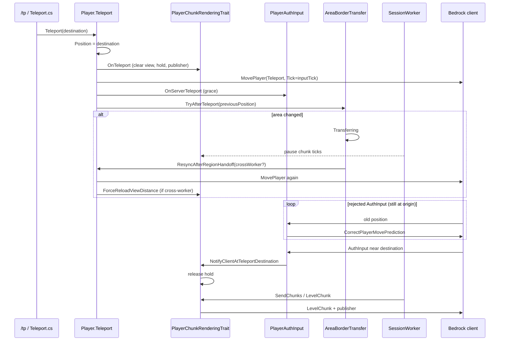

# Teleport (client ↔ server)

This document describes Orion’s teleport flow (e.g. `/tp`), how Bedrock server-authoritative movement treats `MovePlayer`, and why chunk streaming must wait until the client has “arrived” at the destination.

Related: [Chunk streaming](chunk-streaming.md).

## Problems this flow fixes

A long `/tp` (e.g. `0,0` → `1000,1000`) crosses **areas** (area threading) and moves the chunk view center. Three failures showed up together:

1. **Area shortcut** — `/tp` sometimes only enqueued an area transfer and **skipped** `Player.Teleport()`, so the client never got `MovePlayer` or a chunk reload.
2. **Wrong `MovePlayer` tick** — under server-auth movement, the client ignores teleports whose `Tick` is not the **PlayerInputTick** (last `PlayerAuthInput`). Using the world tick leaves the client at `(0,…)` while the server is already at `(1000,…)`.
3. **`LevelChunk` race** — the server sent destination chunks **before** the client applied `MovePlayer`. Still at spawn, the client **discards** out-of-radius chunks. The server marked `loaded=1089/1089` and **never resent** → permanent void at the destination.

## Sequence (same dimension)

### Server steps

1. **`Player.Teleport`**
   - Sets `Position` **before** any area transfer.
   - Fires trait `OnTeleport` (chunk trait clears the old view and arms the **hold**).
   - Sends `MovePlayer` with `Tick = GetLastInputTick()` (not the world tick).
   - On dimension-type change (or force): also `ChangeDimension`.
   - Opens movement grace (`OnServerTeleport`), then calls `AreaBorderTransfer.TryAfterTeleport(server, player, previousPosition)`.

2. **`PlayerChunkRenderingTrait.OnTeleport`**
   - Force-unloads old client chunks (empty `LevelChunk`).
   - Clears `_loadedChunks` / requests / ready.
   - Sends `NetworkChunkPublisherUpdate` at the **new** center.
   - Sets `_awaitingTeleportChunkSync` and `_teleportHoldTicks` (up to ~20 session ticks, or until the client syncs).

3. **Area transfer** (`TryAfterTeleport`)
   - Compares area of the **previous** position vs area of the **current** position (already at destination).
   - Same area: `same-area` log only.
   - Different: `BeginTransfer` → session `Transferring` → `CrossAreaTransferHandler` completes and schedules `ResyncAfterRegionHandoff` on the session thread.

4. **While `Transferring`**
   - `SessionWorker` **skips** session-tick traits (chunks) so streaming does not run mid-handoff.

5. **`ResyncAfterRegionHandoff`**
   - Resends `MovePlayer` (the first one may race the handoff).
   - Cross-worker: `ForceReloadViewDistance()` (forget `loaded` and resend the view).
   - Same-worker: `AfterRegionHandoff()` (publisher / presence only).

6. **Hold release**
   - Preferred: first **accepted** `PlayerAuthInput` (client near server) → `NotifyClientAtTeleportDestination`.
   - Fallback: hold timeout.
   - Only then does the scan send destination `LevelChunk`s.

## Client contract (movement)

| Packet / field | Role |
|----------------|------|
| `MovePlayer` `Mode=Teleport` (or `Reset` on dim change) | Absolute authoritative position. |
| `MovePlayer.Tick` | Must be the **last `PlayerAuthInput` tick**, not the world tick. |
| `StartGame.PlayerMovementSettings.RewindHistorySize` | Must be > 0 (Orion uses `100`) so the client accepts corrections / teleports with rewind. |
| `CorrectPlayerMovePrediction` | Sent when AuthInput is too far from the server (common for a few ticks after `/tp`). |
| Grace (`OnServerTeleport`) | Short window while the client applies MovePlayer. |

It is expected that the server HUD already shows the destination while AuthInput still reports the origin. The chunk hold exists for that window.

## Client contract (chunks)

See [chunk-streaming.md](chunk-streaming.md) for Chebyshev vs circle radius.

Extra rule after teleport:

> **Do not send destination `LevelChunk`s until the client is (or is forced to be) at the destination.**  
> Chunks received outside the client radius are discarded; if the server marks them `loaded`, terrain never comes back.

`ForceReloadViewDistance` after a cross-worker handoff force-unloads and clears `_loadedChunks` in case anything was sent too early.

## Main files

| File | Role |
|------|------|
| `Commands/List/Operator/Teleport.cs` | Always calls `player.Teleport` (no area-only shortcut). |
| `Player/Player.cs` | Orchestrates position, packets, grace, and handoff. |
| `Player/Traits/PlayerChunkRenderingTrait.cs` | Hold, publisher, ForceReload, streaming. |
| `Network/Handlers/PlayerAuthInput.cs` | Validation, grace, `GetLastInputTick`, catch-up notify. |
| `Network/Handlers/ResourcePackClientResponse.cs` | `RewindHistorySize` in StartGame. |
| `Scheduling/AreaBorderTransfer.cs` | `TryAfterTeleport(previousPosition)`. |
| `Scheduling/CrossAreaTransferHandler.cs` | Completes handoff → `ResyncAfterRegionHandoff`. |
| `Scheduling/SessionWorker.cs` | Pauses chunk ticks while `Transferring`. |

## Useful logs

`[Teleport…]` prefixes:

| Prefix | Meaning |
|--------|---------|
| `[Teleport] begin/end` | Enter/leave `Player.Teleport`. |
| `[Teleport:Chunks] OnTeleport` | View cleared + hold armed. |
| `[Teleport:Chunks] clientCaughtUp` / `teleportHold released` | Safe to send `LevelChunk`. |
| `[Teleport:Chunks] SendChunks` | Terrain packets leaving (after hold). |
| `[Teleport:Area] …` | Area / worker handoff. |
| `[Teleport:Move] rejected` | Client still at old position (normal for a few ticks). |
| `[Teleport:Session] pausing…` | Session worker holding stream during transfer. |

On the tip HUD, `hold=N` in `FormatDebugHudLine()` means streaming is still waiting for the client.

## Checklist when changing this flow

1. `/tp` always goes through `Player.Teleport` (position + `MovePlayer` + chunks).
2. `MovePlayer.Tick` = PlayerInputTick; `RewindHistorySize` > 0.
3. Area transfer **after** position/packets; `TryAfterTeleport` uses **previous** vs **current** position.
4. No destination `LevelChunk` while `_awaitingTeleportChunkSync` (unless intentional timeout).
5. Cross-worker handoff: `ForceReloadViewDistance` that **clears** `_loadedChunks`.
6. Test: spawn → far `/tp` (other area) → another `/tp` same area → solid terrain (no void) and `clientCaughtUp` before `SendChunks`.
