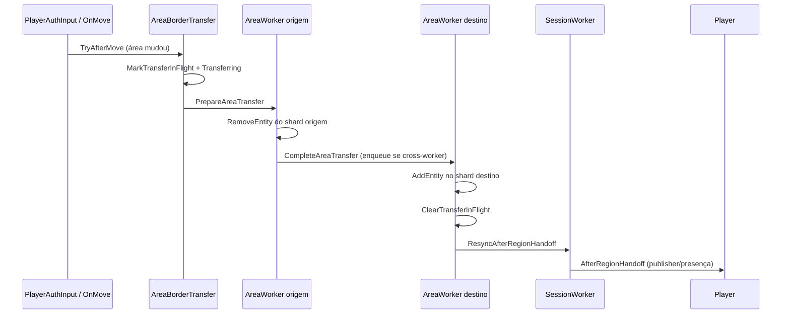

# Area threading (simulação multithread)

Como o Orion divide o mundo em **threading areas**, atribui cada área a um **AreaWorker**, e move entidades (incluindo jogadores) entre workers sem resetar o cliente.

Relacionado: [Teleport](teleport.md) · [Filosofia e arquitetura](architecture-philosophy.md).

## Visão geral

Com area threading ativo (`AreaThreadingEnabled` + scheduler ativo):

- O overworld (e dimensões configuradas) é particionado em **áreas** espaciais (`AreaShard` / `AreaResolver`).
- Cada área anexada roda em um **AreaWorker** dedicado (thread `area-worker-N`).
- Entidades (jogadores e mobs) são **simuladas** (`entity.Tick`) no worker que possui o shard da área atual.
- Chunks dirty são **salvos pelo worker dono** do shard (não no tick global da dimensão), evitando corridas em dicionários compartilhados.
- Streaming de chunks / traits de sessão do jogador rodam no **SessionWorker** (thread separada).

Trocar de área **não** exige teleport no cliente: só muda ownership no servidor (+ `AfterRegionHandoff` para publisher/presença).

## Componentes

| Componente | Papel |
|------------|--------|
| `AreaShard` | Shard estático: chunks + entidades de uma área. Acesso sincronizado; preferir `SnapshotChunks` / `SnapshotEntities`. |
| `AreaShardManager` | Resolve índice de área e agrega shards da dimensão. |
| `AreaWorker` / `AreaWorkerPool` | Loop ~20 TPS: drain inbox → tick entidades anexadas → save dirty periódico. |
| `AreaScheduler` | Anexa/desanexa áreas a workers, inicia transfers, roteia pacotes por área. |
| `AreaBorderTransfer` | Detecta cruzamento de borda (`TryAfterMove` / `TryAfterTeleport`) e inicia handoff. |
| `CrossAreaTransferHandler` | `prepare` no worker origem (remove do shard) → `complete` no destino (add + resync). |
| `SessionWorker` | Ticks de sessão (chunks); pausa o mover enquanto `TransferState.Transferring`. |
| `ThreadGuard` (DEBUG) | Asserts de “esta thread é o worker da área”. |

## Ciclo de um AreaWorker

1. `DrainInbox` (attach/detach, pacotes de área, prepare/complete transfer, jobs).
2. `TickAttachedEntities` — snapshot das entidades de cada shard anexado e `entity.Tick`.
3. `SaveAttachedDirtyChunks` (a cada ~20 ticks) — só shards deste worker.
4. Worker `0` também pode avançar o tick de mundo global quando aplicável.

## Handoff entre áreas

- **Same-worker**: prepare e complete na mesma thread (gap ~zero).
- **Cross-worker**: prepare e complete em threads diferentes (`managedTid` distintos); isso é ownership real.

### Contrato para peers

- Broadcast do `MoveActorDelta` no passo da borda.
- RuntimeId **in-flight** durante prepare→complete: `UpdateVisibleEntities` não manda `RemoveActor`.
- Sem isso, espectadores viam flicker ao jogador sair/entrar de area.

## O que NÃO muda na troca de thread

- Posição do jogador no servidor (já atualizada pelo AuthInput / Teleport).
- Colunas de chunk já carregadas no cliente (sem `ForceReloadViewDistance` só por trocar worker).
- Velocidade do cliente (sem `MovePlayer(Teleport)` no handoff).

Full reload de chunks continua reservado a: mudança de dimensão, ou destino ainda não renderizado (`ForceFullChunkReload` / `OnTeleport`).

## Persistência e thread-safety

- `AreaShard` usa lock interno; enumeração segura via snapshots.
- Save dirty global em `Dimension.Tick` foi removido; cada worker salva seus shards.
- Mutações de entidade/chunk de uma área devem ocorrer no worker anexado (ou via mensagem no inbox).

## Config / debug

- `AreaThreadingEnabled`, contagem de area workers (budget de threads no boot).
- `AreaSchedulerDebug`: logs Debug de attach/transfer (off por padrão).
- Falhas de transfer: `[Area:Transfer] abort` + disconnect do jogador.

## Arquivos principais

| Arquivo | Papel |
|---------|--------|
| `World/Threading/AreaShard.cs` | Dados por área + sync. |
| `World/Threading/AreaShardManager.cs` | Índice / AllChunks. |
| `Orion/Scheduling/AreaWorker.cs` | Loop de simulação. |
| `Orion/Scheduling/AreaScheduler.cs` | Attach + begin transfer + routing. |
| `Orion/Scheduling/AreaBorderTransfer.cs` | Detecção de borda. |
| `Orion/Scheduling/CrossAreaTransferHandler.cs` | Prepare/complete + in-flight. |
| `World/Dimension/Dimension.cs` | `SaveDirtyChunks(AreaShard)`. |

## Checklist ao alterar este sistema

1. Simulação de entidade na área X só no worker anexado a X.
2. Handoff: mark in-flight antes do remove; clear após add.
3. Não forçar teleport/reload de chunks só porque `crossWorker == true`.
4. Save dirty no worker dono, não em loop global sem sync.
5. Peers: delta na borda + sem despawn durante in-flight.
