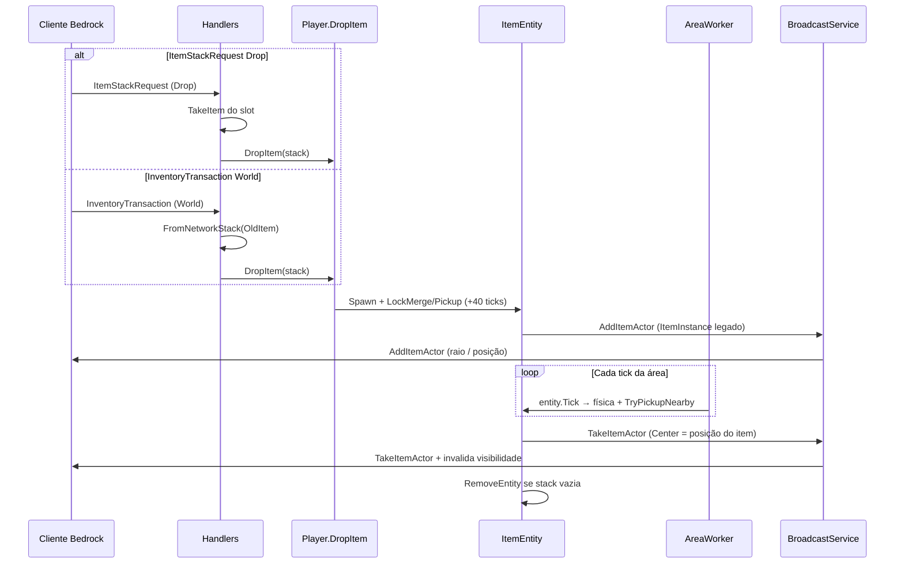

# Drop de itens (cliente ↔ servidor)

Este documento descreve como o Orion trata o **drop** de itens no mundo (tecla Q / arrastar para fora do inventário), o spawn do `ItemEntity`, o tick físico e o pickup — e por que o encoding do protocolo e o broadcast espacial importam.

Relacionado: inventário via `ItemStackRequest` / `InventoryTransaction` (handlers em `src/Orion/Network/Handlers/`).

## Problema que este fluxo resolve

Três falhas apareciam juntas quando o drop “não funcionava” ou o item virava fantasma:

1. **Overflow no decode** — o cliente envia `NetworkItemStackDescriptor` (network id Int16) em `InventoryAction` / held item. Ler como `ItemInstance` (ZigZag legado) desalinha o buffer e quebra o handler.
2. **Item flutua / não sobe** — entidades anexadas à área **não tickavam**: só o worker 0 chamava `world.Tick()`, sem `entity.Tick` nos shards → sem física, merge ou pickup.
3. **Fantasma após pickup** — `RemoveActor` / `TakeItemActor` usavam centro `(0,0,0)` no filtro espacial; o cliente perto do drop não recebia o remove, enquanto o tracking de visibilidade ainda pensava que o ator existia.

## Dois caminhos de drop no protocolo

O Bedrock moderno usa **dois** canais; o Orion trata os dois e acaba em `Player.DropItem`.

| Caminho | Pacote | Quando |
|--------|--------|--------|
| Stack request | `ItemStackRequest` → ação `Drop` (às vezes dentro de `PlayerAuthInput`) | Inventário UI / criativo / hotbar com stack IDs |
| Transação legada | `InventoryTransaction` → `Normal` + `SourceType = World` | Drop “clássico” (world interaction) |



### Passo a passo no servidor

1. **Decode correto**
   - Inventário (`InventoryAction`, held em UseItem*): `NetworkItemStackDescriptor`.
   - Mundo (`AddItemActor`): `ItemInstance` com encoding ZigZag legado — **não** é o mesmo wire format.

2. **`Player.DropItem`**
   - Posição ≈ pés + 1.15 Y; velocidade a partir de yaw/pitch (como Basalt).
   - `LockMergeUntil` / `LockPickupUntil` = tick atual + **40** (evita auto-pickup imediato).
   - `Spawn` → broadcast de `AddItemActor`.

3. **`AreaWorker.TickAttachedEntities`**
   - Em **todo** worker com áreas anexadas, tica entidades do shard.
   - Flush de `PendingDespawn` via `RemoveEntity` (não deixa ator “zumbi” no índice de visibilidade).

4. **Pickup (`ItemEntity.TryPickupNearby`)**
   - Após o lock, raio ~1.5; `player.CollectItem`.
   - Broadcast de `TakeItemActor` com `Center = Position` (não depende de `GetPacketPosition`).
   - Stack 0: `Despawn` + `RemoveEntity` imediato.
   - `BroadcastService` invalida visibilidade no `TakeItemActor` / `RemoveActor` para não reenviar spawn fantasma.

5. **`GetPacketPosition`**
   - Retorna `null` para pacotes sem posição útil (`RemoveActor`, `TakeItemActor`, …) → fan-out a **todos** na dimensão (comportamento Basalt), em vez de filtrar em torno de `(0,0,0)`.

## Encoding: inventário vs ator de item

```
InventoryAction / InventorySlot / Content
  └── NetworkItemStackDescriptor  (Int16 network id, …)

AddItemActor
  └── ItemInstance                (ZigZag network id, …)
```

Converter no servidor: `ItemStack.FromNetworkStack(NetworkItemStackDescriptor)` (e o inverso via `ToNetworkStack` / `LegacyItem` no spawn).

## Arquivos principais

| Peça | Caminho |
|------|---------|
| Drop (ISR) | `src/Orion/Network/Handlers/ItemStackRequest.cs` (`HandleDrop`) |
| Drop (IT) | `src/Orion/Network/Handlers/InventoryTransaction.cs` (`SpawnWorldDrop`) |
| Spawn / locks | `src/Orion/Player/Player.cs` (`DropItem`) |
| Entidade | `src/Orion/Entity/ItemEntity.cs` |
| Tick | `src/Orion/Scheduling/AreaWorker.cs` |
| Broadcast | `src/Orion/Network/BroadcastService.cs`, `DimensionGameplayExtensions.GetPacketPosition` |
| Visibilidade | `orion:player-chunk-rendering` (`IPlayerChunkView`) |

## Checklist de regressão

- [ ] Q no hotbar remove o item e spawna ator no chão perto do jogador.
- [ ] Após ~2 s o item pode ser coletado; aparece animação de take e some do mundo.
- [ ] Outro jogador próximo vê spawn e remoção (sem fantasma).
- [ ] Drop via inventário (UI) e via world-transaction ambos funcionam.
- [ ] Sem `OverflowException` ao dropar / usar item após login.
