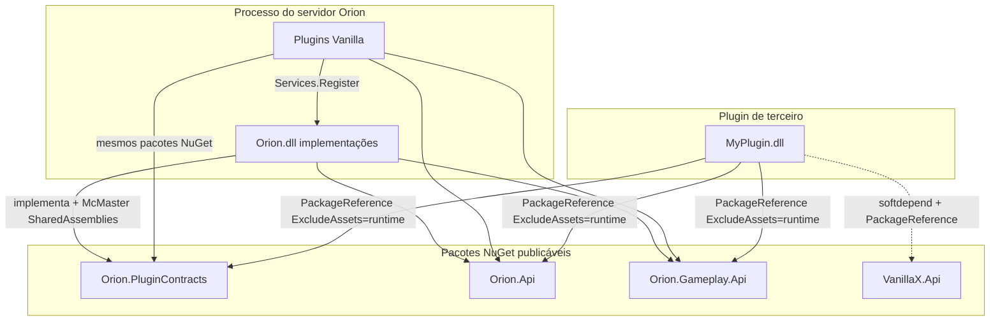

# Fase 9 — Visão geral do Orion Plugin SDK (arquitetura final)

**Status:** `spec`  
**Language twin:** [`../../en_us/plugins/09-sdk-overview.md`](../../en_us/plugins/09-sdk-overview.md)

## 1. Goal

Definir o **SDK final e maximal** de plugins Orion: pacotes NuGet publicados que permitem a terceiros criar **plugins de gameplay profundo** (blocos, itens, inventário, mundo, entidades, containers) **sem clonar o monorepo**, enquanto os plugins first-party Vanilla\* compilam contra os **mesmos** pacotes (dogfooding).

Este documento é a âncora da arquitetura. Ordem de implementação para IAs: [10](10-sdk-packages-versioning.md) → [11](11-sdk-orion-api-surface.md) → [12](12-sdk-registries-traits.md) → [13](13-sdk-events-signals.md) → [14](14-sdk-gameplay-services.md) → [15](15-sdk-protocol-escape.md) → [16](16-sdk-external-plugin-guide.md) → [17](17-sdk-vanilla-dogfood.md) → [18](18-sdk-ai-implementation-checklist.md).

As fases 1–7 ([loader](01-loader-contracts-mcmaster.md) até [conflitos](07-conflicts-compatibility.md)) permanecem o substrato. O SDK **estende** isso; não substitui McMaster, lifecycle nem o shell fino de contracts.

## 2. Non-goals

- Sandbox / isolamento de segurança contra plugins maliciosos.
- Host Native AOT com plugins dinâmicos (incompatível com McMaster).
- Hot-reload / unload na primeira entrega do SDK.
- Publicar um NuGet monolítico `Orion.dll` como API pública.
- Caminho de autoria “DevKit HintPath apontando para Orion.dll do servidor”.
- Interfaces de serviços de terceiros dentro de `Orion.PluginContracts` ou `Orion.Api` (ficam em `Foo.Api` — ver [05](05-services-messaging.md)).

## 3. Grafo final de pacotes



| Pacote | Papel | Shared McMaster |
|--------|-------|-----------------|
| **Orion.PluginContracts** | Lifecycle, shell do event bus, facades finas de registry, services, messenger, packet pipeline | Sim |
| **Orion.Api** | Facades estáveis: server, world, dimension, player, entity, block, item, container; sinais tipados; registries ricos | Sim |
| **Orion.Gameplay.Api** | Serviços de domínio: inventário, building, mining, attributes, item-use | Sim |
| **Vanilla\*.Api** | Extras first-party além do Gameplay.Api (padrão Foo.Api) | Allowlist no host quando first-party |
| **Protocol** (opcional) | Escape hatch de packet/NBT | Não shared por padrão |

## 4. Estado atual → estado final

| Problema hoje | Estado final |
|---------------|--------------|
| Vanilla\* `ProjectReference` `Orion.csproj` | Vanilla\* e terceiros só NuGet |
| `InternalsVisibleTo` Vanilla\* | Removido em plugins de produção; só testes |
| `IOrionServer` / `IOrionWorld` stubs vazios | Facades ricas em `Orion.Api` |
| Interfaces de gameplay em `Orion.dll` | Movidas para `Orion.Gameplay.Api` |
| Registry de bloco/item = allowlist/hash | Registros ricos + trait registries em `Orion.Api` |
| Plugins deep montam packets Protocol à mão | Preferir helpers `Orion.Api`; Protocol é escape documentado |
| `api` no `plugin.json` sem enforcement | Boot valida major.minor do SDK do host |
| Doc “não referenciar Orion” vs realidade Vanilla | Alinhado: ninguém referencia o monólito em compile-time |

## 5. Regras duras (finais)

1. **Sem clone do monorepo** para autorar plugins — NuGet restore basta.
2. **Sem `ProjectReference` a `src/Orion/Orion.csproj`** em qualquer plugin.
3. **Sem `InternalsVisibleTo` para assemblies de plugin** (exceto projetos de teste do core).
4. **Shared types** no ALC = exatamente os assemblies SDK em [10](10-sdk-packages-versioning.md).
5. **`plugin.json` `api`** deve satisfazer a versão do SDK do host (ver [10](10-sdk-packages-versioning.md)).
6. **Capacidades de domínio** via `provides` + `TryGet` (soft) ou `depend` (hard).
7. **Packet hooks** permanecem escape hatch ([15](15-sdk-protocol-escape.md)).

## 6. Matriz use-case → pacotes

| # | Use-case | PluginContracts | Orion.Api | Gameplay.Api | Protocol | Vanilla\*.Api |
|---|----------|:---:|:---:|:---:|:---:|:---:|
| 1 | Filler de aba criativa | obrigatório | — | — | — | — |
| 2 | Comando + mensagem | obrigatório | obrigatório | — | — | — |
| 3 | Economy ↔ Shop soft | obrigatório | — | — | — | Economy.Api |
| 4 | Give / clear / open inventário | obrigatório | obrigatório | obrigatório | — | — |
| 5 | Cancelar place/break; setblock | obrigatório | obrigatório | opcional | — | — |
| 6 | Bloco custom + trait + UI | obrigatório | obrigatório | opcional | escape | — |
| 7 | Item custom + trait | obrigatório | obrigatório | opcional | — | — |
| 8 | Dano / fome / heal | obrigatório | obrigatório | obrigatório | — | — |
| 9 | Container custom Show/Close | obrigatório | obrigatório | opcional | escape | orion:containers |
| 10 | Escape escape hatch | obrigatório | — | — | opcional | — |
| 11 | Generator custom | obrigatório | obrigatório | — | — | — |
| 12 | Dogfood Vanilla\* | obrigatório | obrigatório | obrigatório | escape | conforme |

Walkthroughs: [16](16-sdk-external-plugin-guide.md). Migração Vanilla: [17](17-sdk-vanilla-dogfood.md).

## 7. Glossário (SDK)

| Termo | Significado |
|-------|-------------|
| **SDK** | Conjunto NuGet: PluginContracts + Orion.Api + Gameplay.Api (+ Foo.Api opcional) |
| **Facade** | Interface em Orion.Api implementada por wrappers em Orion.dll |
| **Deep plugin** | Mutação de mundo/inventário/entidades via Orion.Api / Gameplay.Api |
| **Integration plugin** | Só events, services, messenger, registries |
| **Dogfooding** | Vanilla\* compilam contra os mesmos NuGets que terceiros |
| **Escape hatch** | `IPacketPipeline` e/ou pacote Protocol |

## 8. Public API sketch (orientação)

```csharp
void Load(IPluginLoadContext context);
void OnEnable(IPluginContext context);

IPlayer player = /* do sinal */;
IDimension dim = player.Dimension;
dim.SetBlock(x, y, z, block);
player.SendMessage("Olá");

if (context.Services.TryGet(out IPlayerInventoryService? inv) && inv is not null)
    inv.TryGive(player, stack, out _);
```

Superfície completa: [11](11-sdk-orion-api-surface.md), [14](14-sdk-gameplay-services.md).

## 9. File touch list (implementação depois)

| Path | Papel |
|------|-------|
| Novo `src/Orion.Api/Orion.Api.csproj` | Facades, sinais, DTOs ricos |
| Novo `src/Orion.Gameplay.Api/Orion.Gameplay.Api.csproj` | Move de `src/Orion/Gameplay/` |
| `src/PluginContracts/` | Lifecycle; registries evoluem em [12](12-sdk-registries-traits.md) |
| `src/Orion/Plugins/PluginHost.cs` | SharedAssemblies; validar `api` |
| `plugins/Vanilla*/` | PackageReference NuGets |
| `templates/OrionPlugin/` | template `dotnet new` |
| CI | Pack + publish NuGet |

## 10. Acceptance tests (arquitetura)

- Projeto de terceiro restaura só NuGets e compila.
- Plugin carrega no McMaster com `typeof(IPlayer).Assembly` compartilhado com o host.
- VanillaInventory compila sem `ProjectReference` Orion e registra `IPlayerInventoryService`.
- Boot rejeita `api` major.minor mais novo que o host.
- Docs 09–18 só viram `implemented` quando o DoD de [18](18-sdk-ai-implementation-checklist.md) for cumprido.

## 11. Migration notes

- Não publicar caminho “compilar contra Orion.dll”.
- Sem stubs: facades ricas em `Orion.Api` na entrega final.
- Atualizar a regra “não referenciar Orion” para “não referenciar o assembly de **implementação** — usar NuGet SDK”.

## 12. Status

`spec`

## Ordem de leitura

1. Este overview  
2. [10 — Pacotes e versionamento](10-sdk-packages-versioning.md)  
3. [11 — Superfície Orion.Api](11-sdk-orion-api-surface.md)  
4. [12 — Registries e traits](12-sdk-registries-traits.md)  
5. [13 — Events e sinais](13-sdk-events-signals.md)  
6. [14 — Serviços de gameplay](14-sdk-gameplay-services.md)  
7. [15 — Escape Protocol](15-sdk-protocol-escape.md)  
8. [16 — Guia plugin externo](16-sdk-external-plugin-guide.md)  
9. [17 — Dogfood Vanilla](17-sdk-vanilla-dogfood.md)  
10. [18 — Checklist IA](18-sdk-ai-implementation-checklist.md)  
