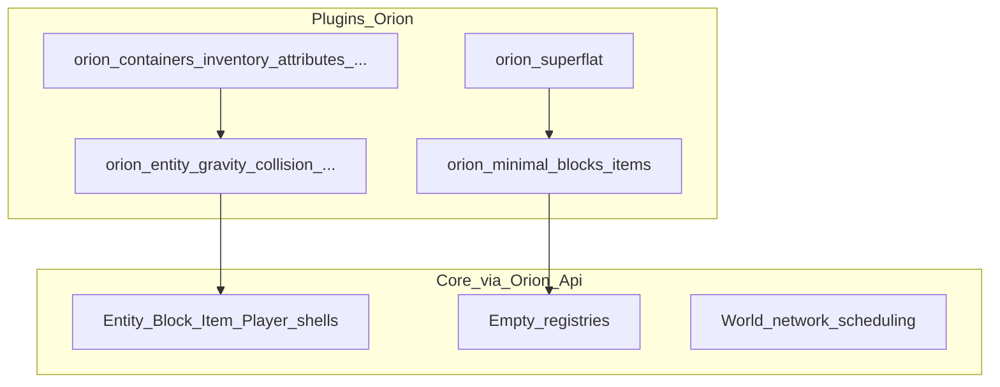
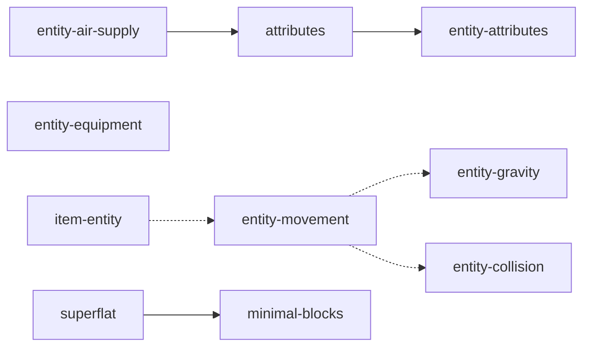

# Fase 22 — Visão: extração Vanilla → plugins

**Status:** `spec`  
**Language twin:** [`../../en_us/plugins/22-vanilla-extraction-overview.md`](../../en_us/plugins/22-vanilla-extraction-overview.md)  
**Depende de:** [09](09-sdk-overview.md)–[18](18-sdk-ai-implementation-checklist.md) (SDK), [17](17-sdk-vanilla-dogfood.md), [19](19-manifest-v2.md)–[21](21-plugin-repo-layout.md)  
**Ordem IA:** [31 — Checklist](31-extraction-ai-checklist.md)

## 1. Goal

Documentar e ordenar a migração de gameplay ainda embutido em `src/Orion/` (**Block**, **Entity**, **Item**, **Player**, **Traits**) e de **conteúdo/worldgen** nativos para **plugins first-party** em `Plugins-Orion/`, de forma que:

1. O core seja uma **engine mínima** (rede, mundo, sessões, scheduling, shells de tipo).
2. Autores de plugins não precisem do monorepo — só NuGet (`PluginContracts` + `Orion.Api` + `Orion.Gameplay.Api`).
3. Cada mecânica genérica (gravidade, colisão, orientação de bloco, …) seja um **plugin dedicado** com deps corretas.
4. Conteúdo mínimo (6 blocos atuais) e **superflat** saiam do core; first-run use generator **`void`**.

Esta fase é a âncora conceitual. Implementação: fases [23](23-extraction-sdk-prerequisites.md)–[30](30-first-run-and-boot-order.md).

## 2. Non-goals

- Reescrever survival vanilla completa nesta série.
- Publicar `Orion.dll` no NuGet.
- Transformar `Entity.cs` / `Block.cs` / registries em “plugins” — são **shells** atrás de `Orion.Api`.
- Exigir API async de worldgen (hoje `Generate` é síncrono).
- Duplicar pipeline de dano fora de `orion:attributes`.

## 3. Modelo híbrido (travado)

| Fica no core / Orion.Api | Vira plugin |
|--------------------------|-------------|
| Shells `Entity`, `Block`, `Item`, `Player` | Traits de mecânica (gravity, collision, …) |
| `Trait` base + detalhes de tick | Traits de bloco/item/player específicos |
| Registries **vazios** + facades de registro | Conteúdo (6 blocos + itens mínimos) |
| Mundo, rede, AreaShards, Protocol | `orion:superflat` |
| `void` generator builtin | Sinais tipados já existentes → catálogo em `Orion.Api.Events` |

## 4. Estado atual (jul/2026)

| Fato | Implicação |
|------|------------|
| 6 blocos em `BlockRegistry.RegisterFromBedrockStates` | Migrar todos para `orion:minimal-blocks` |
| Traits Entity/Block/Item/Player no assembly Orion | Extrair para plugins 24–27 |
| `orion:attributes` já implementa health/hunger + `EntityHurtSignal` | Não criar `orion:entity-damage` paralelo |
| Plugins first-party ainda `ProjectReference` `Orion.csproj` | Bloqueado até SDK 11–12 + dogfood 17 |
| First-run default `generator: superflat` | Fase 30 → `void` |
| `IGeneratorRegistry` + `GeneratorFactory.Register` já existem | Superflat pluga sem inventar loader novo |
| `Generate` / pregen bootstrap síncronos | Fase 23 não exige async |

## 5. Mapa fase → trabalho

| Fase | Foco |
|------|------|
| [23](23-extraction-sdk-prerequisites.md) | Gaps `Orion.Api` / `Gameplay.Api` antes de mover código |
| [24](24-entity-mechanics-plugins.md) | Plugins de traits Entity + item-entity |
| [25](25-block-mechanics-plugins.md) | Plugins de orientação / BlockTrait |
| [26](26-item-mechanics-plugins.md) | Durability / debug / components |
| [27](27-player-mechanics-plugins.md) | Chunk rendering / debug |
| [28](28-minimal-content-and-empty-core.md) | Conteúdo mínimo; core sem registers nativos |
| [29](29-worldgen-superflat-plugin.md) | Superflat plugin; void no core |
| [30](30-first-run-and-boot-order.md) | First-run, load order, survival mínimo |
| [31](31-extraction-ai-checklist.md) | Checklist executável por IA |

## 6. Inventário → ids de plugin (alvo)

| Área | Destino |
|------|---------|
| `EntityGravityTrait` | `orion:entity-gravity` |
| `EntityCollisionTrait` | `orion:entity-collision` |
| `EntityMovementTrait` | `orion:entity-movement` (`softdepend` gravity + collision) |
| `EntityAttributeTrait` (runtime base) | `orion:entity-attributes` — **base**; `orion:attributes` faz `depend` |
| `EntityAirSupplyTrait` | `orion:entity-air-supply` (`depend` `orion:attributes`) |
| `EntityEquipmentTrait` | `orion:entity-equipment` |
| `ItemEntity` | `orion:item-entity` |
| Direction / Facing / Cardinal | `orion:block-direction`, `orion:block-facing`, `orion:block-cardinal` |
| Item durability / debug | `orion:item-durability`, `orion:item-debug` |
| Player chunk / debug | `orion:player-chunk-rendering`, `orion:player-debug` |
| 6 blocos + itens | `orion:minimal-blocks` (+ `orion:minimal-items` ou extensão de creative-fillers) |
| SuperFlat | `orion:superflat` (`depend` minimal-blocks) |
| Já existentes | containers, inventory, block_containers, attributes, building, mining, creative-fillers |

### Grafo de dependências (resumo)

## 7. Regras duras (extração)

1. **Estado final:** zero `ProjectReference` a `Orion.csproj` em qualquer plugin.
2. **Compile** só contra NuGet/SDK: `Orion.PluginContracts`, `Orion.Api`, `Orion.Gameplay.Api` (+ `Foo.Api` se houver).
3. **Template de repo** igual aos plugins atuais: `Plugins-Orion/orion:<id>/`, `plugin.json` v2, `Directory.Build.props`, `PackageId` `Orion.Plugins.*`, workflows CI/publish (paths + auto-bump), Trusted Publishing só `OrionBedrock`.
4. **Commits:** Conventional Commits, granulares, **sem** `Co-authored-by`; preferir PR separado `feat(plugins): …` vs `refactor(orion): remove … from core`.
5. **`air`:** registrado por `orion:minimal-blocks` **antes** do world init (prioridade de load + generators `depend` minimal-blocks). Sem stub permanente de conteúdo no core.
6. **Dano:** ownership permanece em `orion:attributes` (`IEntityHealthService`, sinais hurt/die).

## 8. Template obrigatório por plugin novo

Repetir em cada fase 24–29:

| Campo | Valor |
|-------|--------|
| Pasta local | `Plugins-Orion/orion:<produto>/` |
| Repo GitHub | `OrionBedrock/orion-<produto-com-hífen>` |
| `PackageId` | `Orion.Plugins.<PascalName>` |
| Manifest | v2: `id`, `depend` / `softdepend` / `provides`, `main` |
| MSBuild | `OrionServerBERoot`, `PrivateAssets=all` em refs de build |
| CI | `ci.yml` em `development`; `publish.yml` em `main` com paths + patch bump |
| Branches | Trabalho em `development`; publish ao merge em `main` |

## 9. Relação com fases 00–21

- [00](00-vision-minimal-engine.md) — esta série **concretiza** a visão de engine mínima.
- [09](09-sdk-overview.md)–[18](18-sdk-ai-implementation-checklist.md) — **pré-requisito** de contratos; extração não substitui o SDK.
- [17](17-sdk-vanilla-dogfood.md) — após 24–29, dogfood inclui os **novos** plugins de traits/conteúdo.
- [19](19-manifest-v2.md)–[21](21-plugin-repo-layout.md) — layout e manifest já `implemented`; novos plugins devem obedecer (usar `orion:block_containers` com underscore no id de pasta).

## 10. Acceptance (definição de pronto desta fase doc)

- [ ] Docs 22–31 existem em pt_br + en_us.
- [ ] README do hub lista a seção Extração Vanilla.
- [ ] Grafo de ids e deps está consistente entre 22 e 24–29.
- [ ] Nenhuma fase pede API async de generator como bloqueio duro.

## 11. Status

`spec` — documentação âncora; sem mudança de código só por esta fase.
