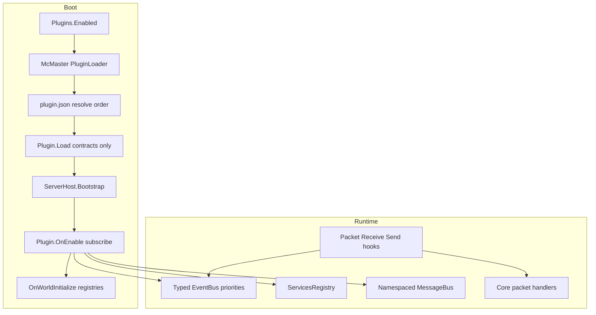

# Arquitetura de plugins Orion

**Status:** Fases 1–7 `implemented` (McMaster + events + registries + services + packet hooks + conflicts). Train do SDK (09–18) permanece `spec`.

Este hub descreve como o Orion vira uma **engine Bedrock mínima** cuja superfície de gameplay cresce com **plugins C# de terceiros**, carregados **exclusivamente** com **McMaster.NETCore.Plugins**, isolados por assembly load context e coordenados por contratos, eventos, registries, services, messaging e packet hooks. Gameplay profundo sem clonar o monorepo está especificado na **série SDK** ([09](09-sdk-overview.md)–[18](18-sdk-ai-implementation-checklist.md)).

English: [`../../en_us/plugins/README.md`](../../en_us/plugins/README.md)

## Decisões travadas

| Tópico | Decisão |
|--------|----------|
| Loader | **Exclusivo** [McMaster.NETCore.Plugins](https://github.com/natemcmaster/DotNetCorePlugins) 2.x — proibido `Assembly.LoadFrom`, ALC próprio ou scan de DLL sem McMaster |
| Contratos | `Orion.PluginContracts` + **`Orion.Api` / `Orion.Gameplay.Api`** (SDK) — plugins **não** referenciam o assembly de implementação Orion |
| Inter-plugin | Services registry (estilo Bukkit) + message bus namespaced (`plugin:channel`) + pacotes opcionais `Foo.Api` |
| Conflitos | Prioridades, cancel/replace, ownership de registry, `provides` / `softdepend` — sem merge mágico |
| Packet hooks | Sim — fase dedicada (estilo Endstone / PocketMine) |
| Runtime | Host **managed** com plugins (não Native AOT) |

## Pipeline de boot (alvo)

## Mapa de fases

| Fase | Doc | Objetivo | Status |
|------|-----|----------|--------|
| 0 | [00 — Visão / engine mínima](00-vision-minimal-engine.md) | O que fica no core vs plugins | `spec` |
| 1 | [01 — Loader e contratos (McMaster)](01-loader-contracts-mcmaster.md) | Isolamento, shared types, layout | `implemented` |
| 2 | [02 — Lifecycle e manifest](02-lifecycle-manifest.md) | Load / Enable / WorldInitialize; `plugin.json` | `implemented` |
| 3 | [03 — Eventos e prioridades](03-events-priorities.md) | Expor bus tipado aos plugins | `implemented` |
| 4 | [04 — Registries e conteúdo](04-registries-content.md) | Itens, blocos, comandos, creative tabs | `implemented` |
| 5 | [05 — Services e messaging](05-services-messaging.md) | Integração soft sem hard load deps | `implemented` |
| 6 | [06 — Packet hooks](06-packet-hooks.md) | Interceptação receive/send de baixo nível | `implemented` |
| 7 | [07 — Conflitos e compatibilidade](07-conflicts-compatibility.md) | Ferramentas quando plugins colidem | `implemented` |
| — | [08 — Checklist de implementação (IA)](08-ai-implementation-checklist.md) | Ordem de PRs da plataforma (fases 1–7) | `spec` |
| 9 | [09 — Visão SDK](09-sdk-overview.md) | Arquitetura final NuGet para plugins deep | `spec` |
| 10 | [10 — Pacotes e versionamento](10-sdk-packages-versioning.md) | Layout NuGet, semver, SharedAssemblies, `api` | `spec` |
| 11 | [11 — Superfície Orion.Api](11-sdk-orion-api-surface.md) | IServer / IWorld / IDimension / IPlayer / block / item / container | `spec` |
| 12 | [12 — Registries e traits](12-sdk-registries-traits.md) | Registros ricos + trait registries | `spec` |
| 13 | [13 — Events e sinais](13-sdk-events-signals.md) | Catálogo final em Orion.Api.Events | `spec` |
| 14 | [14 — Serviços de gameplay](14-sdk-gameplay-services.md) | Orion.Gameplay.Api + provides + ownership de packets | `spec` |
| 15 | [15 — Escape Protocol](15-sdk-protocol-escape.md) | Helpers vs PackageReference Protocol | `spec` |
| 16 | [16 — Guia plugin externo](16-sdk-external-plugin-guide.md) | Template + walkthroughs | `spec` |
| 17 | [17 — Dogfood Vanilla](17-sdk-vanilla-dogfood.md) | First-party no mesmo SDK | `spec` |
| 18 | [18 — Checklist IA SDK](18-sdk-ai-implementation-checklist.md) | Ordem de implementação do train SDK | `spec` |

**Implementado (1–7):** McMaster, lifecycle, registries, events, services/messenger, `IPacketPipeline`, diagnostics de conflitos. Ver [first-run](../first-run.md).

**Próximo (SDK):** começar em [09 — Visão SDK](09-sdk-overview.md); implementar via [18](18-sdk-ai-implementation-checklist.md).

## Glossário

| Termo | Significado |
|-------|-------------|
| **Core / engine** | Rede, persistência de mundo/chunks, sessões, scheduling, codecs de protocolo, conteúdo curado mínimo |
| **Plugin** | Assembly C# publicado em `plugins/<Id>/` implementando `IOrionPlugin` |
| **Contratos / SDK** | `Orion.PluginContracts` + `Orion.Api` + `Orion.Gameplay.Api` — tipos estáveis compartilhados entre ALCs |
| **Hard depend** | Manifest `depend` — boot falha se ausente |
| **Soft depend** | Manifest `softdepend` — só reordena; descoberta em runtime via Services / Messenger |
| **Provides** | Capacidade nomeada para discovery |
| **Ownership de registry** | No máximo um plugin “dona” uma chave (identifier ou PacketId) |
| **Escape hatch** | Packet hooks / Protocol quando ainda não há facade de alto nível |

## Docs relacionados

- [First run](../first-run.md)
- [Inventário criativo](../creative-inventory.md)
- [Filosofia e arquitetura](../architecture-philosophy.md)
- [Status do projeto](../project-status.md)

## Inspiração externa (citada nas fases)

- Paper / Bukkit — events, ServicesManager, softdepend
- PocketMine-MP — `DataPacketReceiveEvent`, depend/softdepend no plugin.yml
- Endstone — `PacketReceiveEvent` / `PacketSendEvent` no Bedrock
- SerenityJS / the-aether — `onInitialize` / `onWorldInitialize` + palettes
- McMaster DotNetCorePlugins — isolamento ALC e `sharedTypes`
