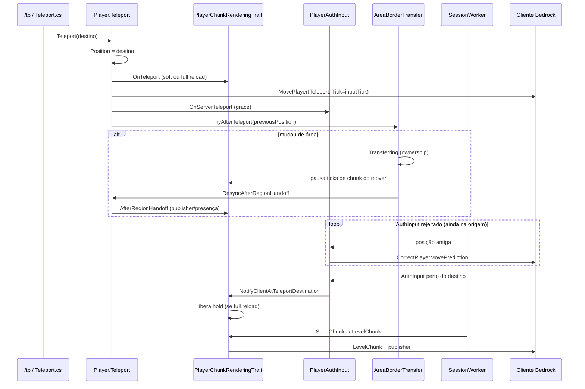

# Teleport (cliente ↔ servidor)

Fluxo atual de teleport no Orion (ex.: `/tp`), movimento server-authoritative Bedrock, streaming de chunks e interação com area threading.

Relacionado: [Streaming de chunks](chunk-streaming.md) · [Area threading](area-threading.md).

## Problema que este fluxo resolve

Um `/tp` longo (ex.: `0,0` → `1000,1000`) atravessa **áreas** e muda o centro da view. Falhas históricas que o fluxo atual evita:

1. Transferência de área sem `Player.Teleport()` (cliente sem `MovePlayer` / chunks).
2. `MovePlayer.Tick` com tick do mundo em vez do **PlayerInputTick** (cliente ignora o teleport).
3. `LevelChunk` do destino antes do cliente aplicar o `MovePlayer` (chunks descartados; servidor marcava `loaded` e não reenviava).

## Sequência (mesma dimensão)

### Passo a passo no servidor

1. **`Player.Teleport`**
   - Atualiza `Position` **antes** de qualquer transferência de área.
   - Dispara `OnTeleport` nos traits.
   - Envia `MovePlayer` com `Tick = GetLastInputTick()` (não o tick do mundo).
   - Em mudança de tipo de dimensão (ou force): também `ChangeDimension`.
   - Abre grace (`OnServerTeleport`) e chama `AreaBorderTransfer.TryAfterTeleport(previousPosition)`.

2. **`PlayerChunkRenderingTrait.OnTeleport`**
   - **Full reload** se `ForceFullChunkReload` (mudança de dimensão) **ou** o chunk de destino ainda não está em `_loadedChunks`: unload no cliente, zera loaded/requests, publisher novo, hold até o cliente sincronizar.
   - **Soft** se o destino já está renderizado (ex.: `/tp` só em Y, ou área nova com view ainda válida): mantém colunas, só retarget de streaming / presença.

3. **Transferência de área** (`TryAfterTeleport` / `TryAfterMove`)
   - Compara área da posição anterior com a da atual.
   - Se diferente: `BeginTransfer` → sessão `Transferring` → `CrossAreaTransferHandler` (prepare no worker origem, complete no destino) → `ResyncAfterRegionHandoff` no thread de sessão.

4. **Enquanto `Transferring`**
   - `SessionWorker` não roda traits de tick de sessão **do jogador em transfer** (chunks), para não misturar stream no meio do handoff.

5. **`ResyncAfterRegionHandoff`**
   - Sempre soft: só `AfterRegionHandoff()` (publisher + presença + entidades visíveis).
   - Troca de worker/thread é **só ownership no servidor** — sem segundo `MovePlayer` e sem `ForceReloadViewDistance`.

6. **Liberação do hold** (full reload)
   - Preferencial: primeiro `PlayerAuthInput` aceito perto do destino → `NotifyClientAtTeleportDestination`.
   - Fallback: timeout do hold.
   - Só então o scan envia `LevelChunk` do destino.

## Visibilidade para outros jogadores (borda)

No passo que cruza a borda:

- O `MoveActorDelta` do mover **ainda é broadcastado** aos peers (antes do early-return do transfer).
- Durante o gap prepare→complete o runtimeId fica **in-flight**; peers **não** enviam `RemoveActor` só porque a entidade sumiu temporariamente de `GetEntities()`.
- Assim o espectador não vê flicker remove→add ao cruzar threading areas.

## Contrato com o cliente (movimento)

| Pacote / campo | Papel |
|----------------|--------|
| `MovePlayer` `Mode=Teleport` (ou `Reset` em change dim) | Posição absoluta autoritativa. |
| `MovePlayer.Tick` | Último tick de `PlayerAuthInput`, não o tick do mundo. |
| `StartGame.PlayerMovementSettings.RewindHistorySize` | > 0 (Orion usa `100`) para aceitar correções / teleports com rewind. |
| `CorrectPlayerMovePrediction` | Quando AuthInput está longe demais do servidor (comum logo após `/tp`). |
| Grace (`OnServerTeleport`) | Alguns ticks esperando o cliente aplicar o MovePlayer. |

## Contrato com o cliente (chunks)

Ver [chunk-streaming.md](chunk-streaming.md).

Regra pós-teleport (full reload): hold até o cliente estar no destino (ou timeout) antes de marcar/enviar `LevelChunk` novos.

## Arquivos principais

| Arquivo | Papel |
|---------|--------|
| `Player/Player.cs` | `Teleport`, `ResyncAfterRegionHandoff`. |
| `orion:player-chunk-rendering` (`IPlayerChunkView`) | Soft/full `OnTeleport`, hold, `AfterRegionHandoff`, visibilidade. |
| `Network/Handlers/PlayerAuthInput.cs` | Aceite de movimento, grace, `MoveActorDelta`, borda. |
| `Scheduling/AreaBorderTransfer.cs` | `TryAfterMove` / `TryAfterTeleport`. |
| `Scheduling/CrossAreaTransferHandler.cs` | Prepare/complete + in-flight + resync. |
| `Scheduling/SessionWorker.cs` | Pausa chunk ticks enquanto `Transferring`. |

## Logs úteis

| Prefixo | Significado |
|---------|-------------|
| `[Teleport] begin/end` | Entrada/saída de `Player.Teleport`. |
| `[Teleport:Chunks] OnTeleport` | Soft vs full reload. |
| `[Teleport:Chunks] clientCaughtUp` / `teleportHold released` | Seguro enviar `LevelChunk` (full reload). |
| `[Teleport:Move] rejected` | Cliente ainda na origem (normal por poucos ticks). |

Handoff de area fica silencioso em Info; falhas: `[Area:Transfer] abort` / Warn. Debug: `AreaSchedulerDebug`.

## Checklist ao alterar este fluxo

1. `/tp` sempre passa por `Player.Teleport` (posição + `MovePlayer` + chunks).
2. `MovePlayer.Tick` = último input tick.
3. Full reload arma hold antes de LevelChunks do destino.
4. Handoff de area: ownership no servidor + `AfterRegionHandoff` — sem segundo teleport só por trocar de thread.
5. Peers: `MoveActorDelta` na borda + sem `RemoveActor` enquanto in-flight.
