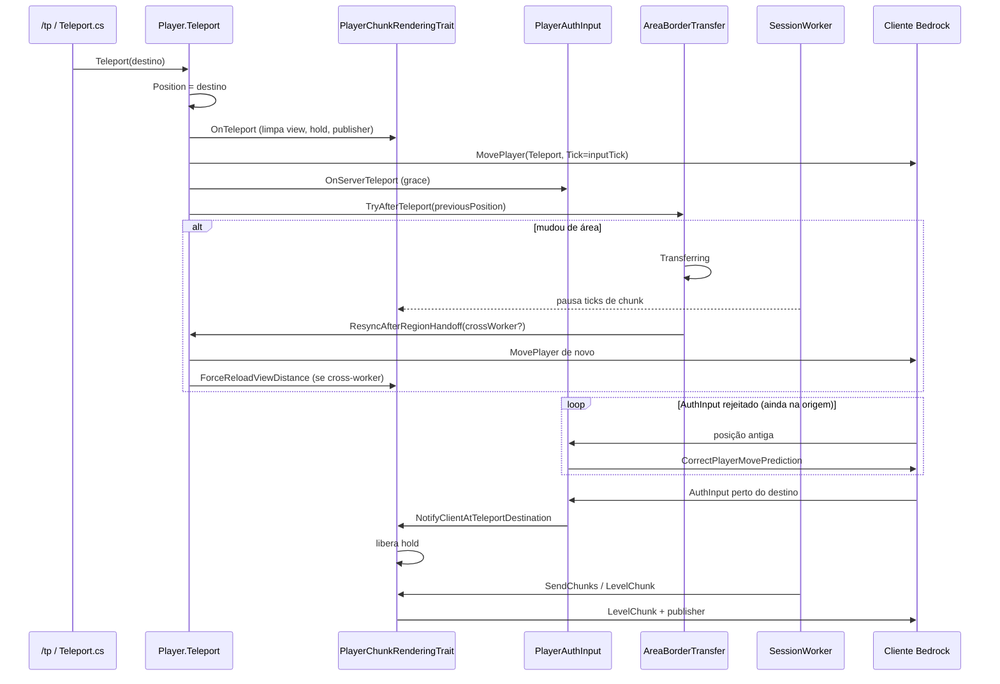

# Teleport (cliente ↔ servidor)

Este documento descreve o fluxo de um teleport no Orion (ex.: `/tp`), como o movimento server-authoritative do Bedrock interpreta `MovePlayer`, e por que o streaming de chunks precisa esperar o cliente “chegar” no destino.

Relacionado: [Streaming de chunks](chunk-streaming.md).

## Problema que este fluxo resolve

Um `/tp` longo (ex.: `0,0` → `1000,1000`) atravessa **áreas** (area threading) e muda o centro da view de chunks. Três falhas apareciam juntas:

1. **Atalho de área** — o comando `/tp` às vezes só enfileirava transferência de área e **não** chamava `Player.Teleport()`, então o cliente não recebia `MovePlayer` nem reload de chunks.
2. **Tick errado no `MovePlayer`** — com movimento server-auth, o cliente ignora teleports cujo `Tick` não é o **PlayerInputTick** (último `PlayerAuthInput`). Usar o tick do mundo faz o cliente continuar em `(0,…)` enquanto o servidor já está em `(1000,…)`.
3. **Race de `LevelChunk`** — o servidor enviava chunks do destino **antes** do cliente aplicar o `MovePlayer`. O cliente, ainda no spawn, **descarta** chunks fora do raio. O servidor marcava `loaded=1089/1089` e **não reenviava** → void eterno no destino.

## Sequência (mesma dimensão)

### Passo a passo no servidor

1. **`Player.Teleport`**
   - Atualiza `Position` **antes** de qualquer transferência de área.
   - Dispara `OnTeleport` nos traits (chunks limpam a view antiga e armam o **hold**).
   - Envia `MovePlayer` com `Tick = GetLastInputTick()` (não o tick do mundo).
   - Em mudança de tipo de dimensão (ou force): também `ChangeDimension`.
   - Abre grace de movimento (`OnServerTeleport`) e só **depois** chama `AreaBorderTransfer.TryAfterTeleport(server, player, previousPosition)`.

2. **`PlayerChunkRenderingTrait.OnTeleport`**
   - Unload forçado dos chunks antigos no cliente (`LevelChunk` vazio).
   - Zera `_loadedChunks` / requests / ready.
   - Envia `NetworkChunkPublisherUpdate` no **novo** centro.
   - Liga `_awaitingTeleportChunkSync` e `_teleportHoldTicks` (até ~20 ticks de sessão, ou até o cliente sincronizar).

3. **Transferência de área** (`TryAfterTeleport`)
   - Compara área da **posição anterior** com a área da **posição atual** (já no destino).
   - Se igual: só log `same-area`, sem handoff.
   - Se diferente: `BeginTransfer` → sessão `Transferring` → `CrossAreaTransferHandler` completa e agenda `ResyncAfterRegionHandoff` no thread de sessão.

4. **Enquanto `Transferring`**
   - `SessionWorker` **não** roda traits de tick de sessão (chunks), para não misturar stream no meio do handoff.

5. **`ResyncAfterRegionHandoff`**
   - Reenvia `MovePlayer` (o primeiro pode ter “perdido” a corrida com o handoff).
   - Cross-worker: `ForceReloadViewDistance()` (esquece `loaded` e reenvia a view).
   - Same-worker: `AfterRegionHandoff()` (só publisher / presença).

6. **Liberação do hold**
   - Preferencial: primeiro `PlayerAuthInput` **aceito** (posição do cliente perto do servidor) → `NotifyClientAtTeleportDestination`.
   - Fallback: timeout do hold.
   - Só então o scan envia `LevelChunk` do destino.

## Contrato com o cliente (movimento)

| Pacote / campo | Papel |
|----------------|--------|
| `MovePlayer` `Mode=Teleport` (ou `Reset` em change dim) | Posição absoluta autoritativa. |
| `MovePlayer.Tick` | Deve ser o **último tick de `PlayerAuthInput`**, não o tick do mundo. |
| `StartGame.PlayerMovementSettings.RewindHistorySize` | Precisa ser > 0 (Orion usa `100`) para o cliente aceitar correções / teleports com rewind. |
| `CorrectPlayerMovePrediction` | Enviado quando AuthInput está longe demais do servidor (comum nos ticks logo após o `/tp`). |
| Grace (`OnServerTeleport`) | Alguns ticks em que o servidor espera o cliente aplicar o MovePlayer sem “brigar” tanto com o anti-cheat de distância. |

Enquanto o AuthInput ainda reporta a origem, o HUD do servidor já mostra o destino — isso é esperado. O hold de chunks existe exatamente por causa dessa janela.

## Contrato com o cliente (chunks)

Ver [chunk-streaming.md](chunk-streaming.md) para raio Chebyshev vs círculo.

Regra extra pós-teleport:

> **Não envie `LevelChunk` do destino até o cliente estar (ou ser forçado a estar) no destino.**  
> Chunks recebidos fora do raio do cliente são descartados; se o servidor os marcar como `loaded`, o terreno nunca reaparece.

`ForceReloadViewDistance` após handoff cross-worker faz unload forçado + clear de `_loadedChunks` para o caso de algum pacote ter saído cedo demais.

## Arquivos principais

| Arquivo | Responsabilidade |
|---------|------------------|
| `Commands/List/Operator/Teleport.cs` | Sempre chama `player.Teleport` (sem atalho só de área). |
| `Player/Player.cs` | Orquestra posição, pacotes, grace e handoff. |
| `Player/Traits/PlayerChunkRenderingTrait.cs` | Hold, publisher, ForceReload, streaming. |
| `Network/Handlers/PlayerAuthInput.cs` | Validação, grace, `GetLastInputTick`, notify de catch-up. |
| `Network/Handlers/ResourcePackClientResponse.cs` | `RewindHistorySize` no StartGame. |
| `Scheduling/AreaBorderTransfer.cs` | `TryAfterTeleport(previousPosition)`. |
| `Scheduling/CrossAreaTransferHandler.cs` | Completa handoff → `ResyncAfterRegionHandoff`. |
| `Scheduling/SessionWorker.cs` | Pausa ticks de chunk enquanto `Transferring`. |

## Logs úteis

Prefixos `[Teleport…]` no log:

| Prefixo | Significado |
|---------|-------------|
| `[Teleport] begin/end` | Entrada/saída de `Player.Teleport`. |
| `[Teleport:Chunks] OnTeleport` | View limpa + hold armado. |
| `[Teleport:Chunks] clientCaughtUp` / `teleportHold released` | Seguro enviar `LevelChunk`. |
| `[Teleport:Chunks] SendChunks` | Pacotes de terreno saindo (depois do hold). |
| `[Teleport:Area] …` | Handoff entre áreas / workers. |
| `[Teleport:Move] rejected` | Cliente ainda na posição antiga (normal por poucos ticks). |
| `[Teleport:Session] pausing…` | Session worker segurando stream durante transfer. |

No tip HUD, `hold=N` em `FormatDebugHudLine()` indica que o stream ainda está esperando o cliente.

## Checklist ao alterar este fluxo

1. `/tp` sempre passa por `Player.Teleport` (posição + `MovePlayer` + chunks).
2. `MovePlayer.Tick` = PlayerInputTick; `RewindHistorySize` > 0.
3. Transferência de área **depois** da posição/pacotes; `TryAfterTeleport` usa posição **anterior** vs **atual**.
4. Nenhum `LevelChunk` do destino enquanto `_awaitingTeleportChunkSync` (exceto timeout consciente).
5. Cross-worker handoff: `ForceReloadViewDistance` que **limpa** `_loadedChunks`.
6. Testar: spawn → `/tp` longe (outra área) → outro `/tp` mesma área → confirmar terreno sólido (não void) e `clientCaughtUp` antes de `SendChunks`.
